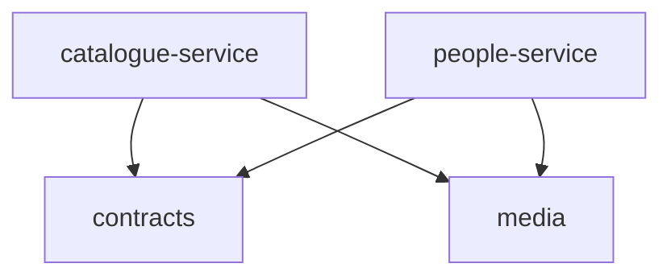
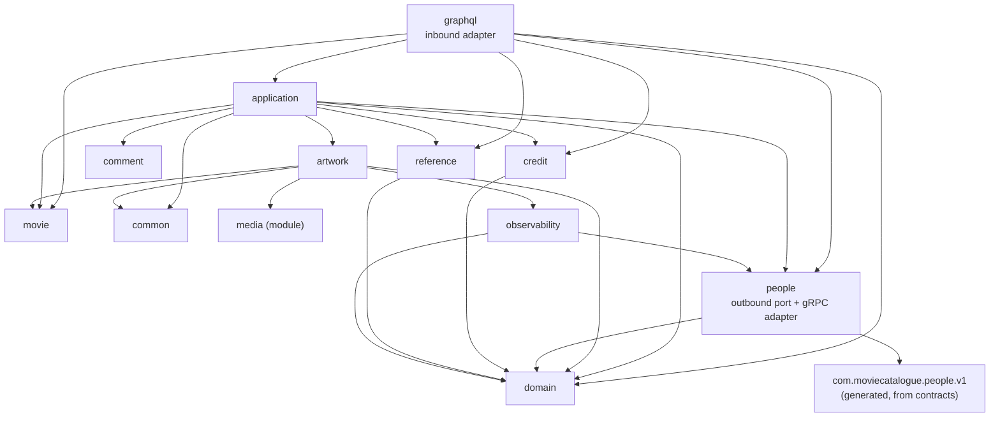
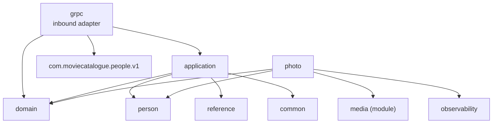
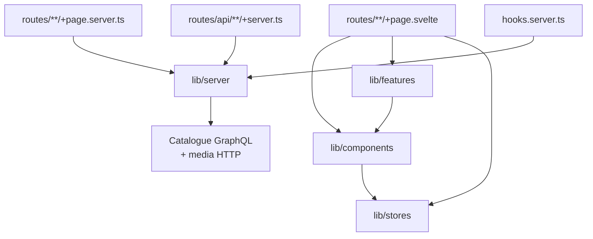
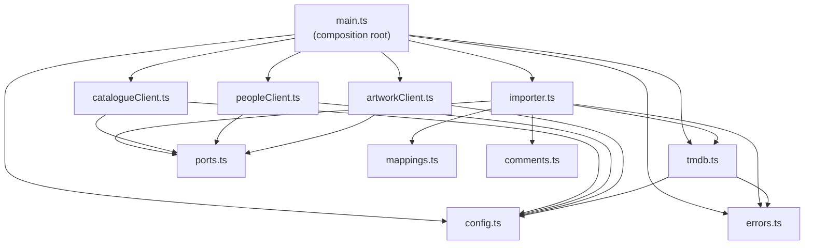

# Code graph

```yaml
status: current
canonical_for: dependency-edges
last_verified: 2026-09-19
```

What actually depends on what. [overview.md](overview.md) states the *rules*
(dependency direction, what a layer may not import) and [code-map.md](code-map.md)
says where a new file belongs; this file is the measured graph those rules are
supposed to produce, so a violation shows up as an edge that should not exist.

Every edge below was extracted from the source at the date above — backend edges
from Kotlin `import com.moviecatalogue.*` statements, frontend edges from `$lib/*`
and `$app/*` specifiers, importer edges from relative `./*.js` specifiers. Counts are the number of import statements, not call
sites. Generated output (`build/`, `bin/`, `.svelte-kit/`) and test sources are
excluded.

## 1. Build modules



Four Gradle modules, registered in `backend/settings.gradle.kts`. The graph is a
DAG with two sinks: `contracts` (protobuf/gRPC types only) and `media` (storage
port and adapters only). **The two services do not depend on each other** — that
is the single most important property of this graph, and it is what makes ADR-1's
ownership split enforceable rather than aspirational. Catalogue reaches People
only through the generated stubs in `contracts`, over the network.

## 2. Catalogue Service package graph



| From | To | Imports |
|---|---|---|
| `graphql` | `application` | 21 |
| `graphql` | `domain` | 11 |
| `graphql` | `reference`, `people`, `movie`, `credit`, `artwork` | 3, 3, 1, 1, 1 |
| `application` | `domain` | 23 |
| `application` | `reference` | 15 |
| `application` | `movie`, `people` | 11, 11 |
| `application` | `credit` | 9 |
| `application` | `common` | 5 |
| `application` | `artwork`, `comment` | 2, 2 |
| `artwork` | `com.moviecatalogue.media` | 16 |
| `people` | `com.moviecatalogue.people.v1` | 11 |

Read the table as a shape rather than a score: `domain` is the most-imported
package and imports nothing back, `graphql` imports and is imported by nothing,
and every arrow points inward or sideways. There is no cycle.

Two edges are worth naming because they look like exceptions and are not:

- **`graphql → domain` (11).** The inbound adapter imports domain *exception*
  types so `GraphQlExceptionResolver` can map them to `extensions.code` values
  (see [interfaces.md](interfaces.md#error-contract)). It maps errors; it does
  not apply rules.
- **`graphql → movie`/`credit`/`artwork` (1 each).** Entity types reached through
  the application layer's return values, not repository access. The rule that
  matters — "controllers must not query repositories directly" — still holds.

## 3. People Service package graph



| From | To | Imports |
|---|---|---|
| `grpc` | `com.moviecatalogue.people.v1` | 15 |
| `grpc` | `domain` | 7 |
| `grpc` | `application` | 5 |
| `application` | `domain` | 7 |
| `application` | `person`, `reference`, `common` | 2, 2, 2 |
| `photo` | `com.moviecatalogue.media` | 17 |
| `photo` | `domain`, `person` | 3, 2 |

Nothing in this service imports anything under `com.moviecatalogue.catalogue`.
`photo` is a parallel vertical to `grpc`: profile-photo bytes travel over HTTP,
not gRPC, so it has its own inbound controller and reaches `person` directly
rather than through `application`.

## 4. Frontend module graph



| From | To | Imports |
|---|---|---|
| `routes/**/+page.svelte` | `lib/components` | 47 |
| `routes/**/+page.server.ts` | `lib/server` | 24 |
| `routes/**/+page.svelte` | `lib/features` | 8 |
| `routes/api/**/+server.ts` | `lib/server` | 8 |
| `lib/features` | `lib/components` | 4 |
| `lib/components` | `lib/stores` | 1 |

**`lib/server` is imported by 11 browser-reachable files, and all 11 are
`import type`.** Every one of them names only `$lib/server/types`, so TypeScript
erases the import and no server module reaches the bundle. SvelteKit would fail
the build otherwise; the point of recording it here is that the raw edge looks
like a layering violation in any tool that does not distinguish type imports.

The graph has no edge from `lib/components` or `lib/features` back to a route,
and none from `lib/server` to either — presentation does not know about loaders,
and loaders do not know about components.

## 5. Importer module graph

`demo/importer/src` is flat — no directories — so the layering is expressed by
which file imports which. Edges are `import ... from './x.js'` specifiers.



The property worth checking here: **`importer.ts` does not import any of the
three clients.** It takes them as `Dependencies` typed by `ports.ts`, and only
`main.ts` knows the concrete ones exist. That is what lets the import logic —
idempotency, credit selection, per-movie failure isolation — be unit-tested
against in-memory fakes with no stack running, which is where 39 of the
repository's tests live.

`ports.ts` and `config.ts` are sinks: they import nothing local. `mappings.ts`
and `comments.ts` are leaf data tables (TMDB id → controlled code, seed comment
fixtures) with no imports at all.

## 6. Two end-to-end chains

These are the paths a change most often has to be traced along. Symbols are real;
follow them in the source rather than trusting the summary.

### Reading one movie, with its credits

```text
browser  GET /movies/[id]
  routes/movies/[id]/+page.server.ts  load()
    $lib/server/operations.ts         getMovie(id, ctx)
      $lib/server/graphql.ts          gql()            — adds X-Correlation-ID
        ── HTTP POST /graphql ──▶ catalogue-service
  graphql/MovieController             @QueryMapping movie(id)
    application/MovieUseCases                          — movie row
    graphql/MovieController           @SchemaMapping cast / creators / genres / artwork
      application/MovieReadService    credits(movieId, category), genres(), artwork()
    graphql/MovieController           @SchemaMapping MovieCredit.person
      graphql/PersonReferenceDataLoader                — batches every personId on the page
        application/PersonHydrator
          people/PeopleClient         getPeople(ids)
            people/PeopleGrpcClient   ── gRPC GetPeople ──▶ people-service
  people  grpc/PeopleGrpcService      GetPeople
    application/PeopleApplicationService
      person/PersonRepository
```

The DataLoader is the reason a movie with 40 credits makes **one** gRPC call, not
40. A person People no longer has comes back as `PersonReference.available =
false` rather than an error, so one deleted person cannot fail the whole page.

### Replacing a movie's artwork

```text
browser  POST multipart  /movies/[id]/edit?/uploadArtwork
  routes/movies/[id]/edit/+page.server.ts   actions.uploadArtwork
    $lib/server/media.ts   uploadMovieArtwork() — forwards the multipart body
      ── HTTP ──▶ catalogue-service
  artwork/MovieArtworkController
    artwork/ArtworkUseCases          uploadMovieArtwork()
      media/ImageContentValidator            — size, magic bytes, decodability
      media/ArtworkStore.put                 ──▶ MinioArtworkStore ──▶ catalogue-artwork bucket
      media/WebpEncoder + store.put          — best-effort variant; null if cwebp is absent
      artwork/ArtworkRepository              — metadata swap, one DB transaction
      media/ArtworkStore.delete              — compensate on rollback, then drop the old object
  artwork/ArtworkOrphanSweeper               — scheduled; catches whatever the above missed
```

The database and MinIO cannot share a transaction, so this chain is ordered
validate → store → commit → clean up, with the sweeper as the backstop. The
sweeper must treat **both** `storage_key` and `webp_storage_key` as referenced —
see [data-model.md](data-model.md).

## 7. Keeping this file honest

The edges here are mechanical, so they can be regenerated rather than reviewed by
eye. Backend:

```bash
grep -rhoE "^import com\.moviecatalogue\.[a-z.]+" backend/*/src/main/kotlin --include="*.kt" | sort | uniq -c | sort -rn
```

Frontend:

```bash
grep -rhoE "from '\\\$(lib|app)/[a-z/]+'" frontend/src --include="*.ts" --include="*.svelte" | sort | uniq -c | sort -rn
```

Importer:

```bash
grep -rhoE "from './[a-zA-Z]+\.js'" demo/importer/src --include="*.ts" --exclude="*.test.ts" | sort | uniq -c | sort -rn
```

If a regenerated edge is not in this file, either the file is stale or a layering
rule in [overview.md](overview.md#6-dependency-and-consistency-rules) has been
broken. Decide which before editing the table.

## Related

- [Architecture overview](overview.md) — the rules these edges are measured against
- [Code map](code-map.md) — where a new file belongs
- [Frameworks](frameworks.md) — what each layer is built out of
- [Data model](data-model.md) · [Interfaces](interfaces.md)
