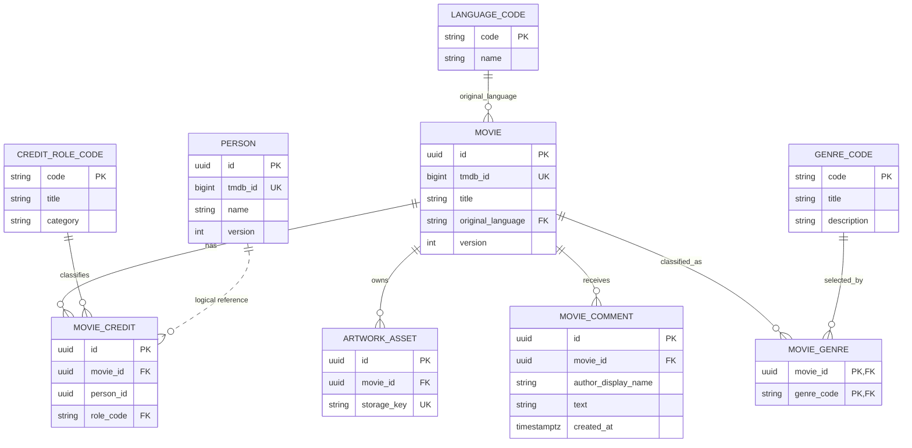

# Data model

```yaml
status: current
canonical_for: data-ownership-and-invariants
last_verified: 2026-09-15
```

DDL below is illustrative of intent and invariants — the Flyway migrations under
`backend/catalogue-service/src/main/resources/db/migration/` and
`backend/people-service/src/main/resources/db/migration/` are the authoritative
current schema. If they disagree, the migrations win; update this file.

## Ownership model



The dotted Person-to-Credit relationship is logical. There is no cross-service
database foreign key — Catalogue stores only a `person_id`; People is authoritative
for name/biography/photo.

**Primary key strategy: application-generated UUIDv7.** All primary keys are UUIDs
generated in application (Kotlin) code as UUIDv7 (time-ordered) at entity creation;
the database column type stays `UUID` with no DB-side default (do not use
`gen_random_uuid()`, which is random UUIDv4). UUIDv7 embeds a millisecond timestamp
prefix, so newly inserted keys are near-monotonic, reducing B-tree index
fragmentation and improving insert locality versus random UUIDv4. See ADR-10. The
external `tmdb_id` remains a nullable provenance column, never the primary key, so
user-created data works without TMDB.

## Design notes and invariants

- `tmdb_credit_id` makes imports idempotent; a second unique index prevents
  duplicate manual associations.
- Genre and role tables are reference/code tables maintained through Flyway.
  `active = false` retires a code without invalidating historical rows.
- Prefer self-describing codes (`PRODUCER`, `PSYCHOLOGICAL_HORROR`) over short
  codes — short codes are easier to misread, collide, and misuse in logs/APIs.
- `category` is repeated on `movie_credit` so a database check can validate
  cast/crew-specific fields; a composite foreign key guarantees it agrees with the
  selected role code.
- `source_role_name` preserves an external TMDB job label when several external
  values map to one controlled internal role.
- Keep `genre_code` and `credit_role_code` as separate tables rather than one
  generic `code_table(type, code, ...)`: different attributes, validation, and
  foreign-key targets; separate tables prevent a genre from accidentally being
  used as a credit role.
- `movie.original_language` (v2.1) is a nullable FK to `language_code`, an
  ISO 639-1 controlled reference table (same `active`/`display_order` shape
  as `genre_code`/`credit_role_code`). This replaced a free-text `VARCHAR(10)`
  column; `V5__add_language_reference_data.sql` nulls out any pre-existing
  value that doesn't match the seeded set before adding the constraint.
- `version` is mapped with JPA `@Version` for optimistic concurrency on `movie`
  and `person`. `movie_credit` intentionally has no version column — see
  "Credit concurrency" below.
- `movie_comment` is Catalogue-owned and cascades with its movie. Its descending
  composite index `(movie_id, created_at DESC, id DESC)` supports stable
  reverse-chronological pages; UUIDv7 `id` breaks timestamp ties.
- At the assumed scale (under 100k movies, 500k people), normalized columns and
  B-tree indexes are sufficient. If substring search becomes material, enable
  `pg_trgm` and add GIN trigram indexes after measuring (ADR-9).
- Do not enforce unique person names: different people can share a name.
  Deduplication for imported records uses `tmdb_id`; manually created people may
  need human review.

## Transaction boundaries

| Use case | Transaction |
|---|---|
| Create/update/delete movie | One Catalogue DB transaction |
| Add/update/remove credit | One Catalogue DB transaction; remote existence check occurs before it |
| Add/read comment | One Catalogue DB transaction/read boundary; timestamp generated by Catalogue |
| Create/update/delete person | One People DB transaction |
| Replace artwork/photo | Validate and store new MinIO object, commit metadata swap, compensate on rollback, then best-effort delete old object |
| TMDB import | One item at a time, idempotent upserts; never one giant distributed transaction |

**Credit concurrency (accepted decision).** `updateMovieCredit` intentionally does
not take an `expectedVersion`. Movies and people carry optimistic-lock versions
because they are the primary editable aggregates; credit rows are small,
subordinate to a movie, and rarely edited concurrently by two users. Last-write-wins
is accepted for credit updates as a proportionate trade-off (ADR-13). If concurrent
credit editing becomes a real scenario, add a `version` column to `movie_credit`
and an `expectedVersion` argument to `updateMovieCredit`.

## Why PostgreSQL, why JPA

Movies and people have a many-to-many relationship whose relationship carries data
(role code, category, character, source job label, billing order) — a natural
associative relational entity. PostgreSQL gives strong constraints, transactional
CRUD, and a search/index growth path. MySQL would also be valid; PostgreSQL is a
preference, not a requirement. The domain is small and CRUD-heavy, so JPA removes
repetitive persistence plumbing; explicit repository queries handle
search/pagination to avoid accidental N+1 behaviour.

## Related

- [Interfaces](interfaces.md) — how this data is exposed over GraphQL/gRPC
- [ADR-2](../decisions/0002-postgresql-normalized-moviecredit.md), [ADR-5](../decisions/0005-controlled-code-tables.md), [ADR-10](../decisions/0010-uuidv7-primary-keys.md), [ADR-13](../decisions/0013-credit-last-write-wins.md)
