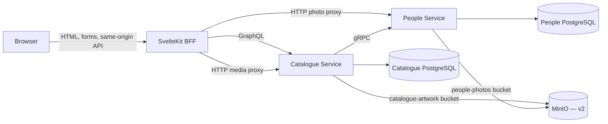
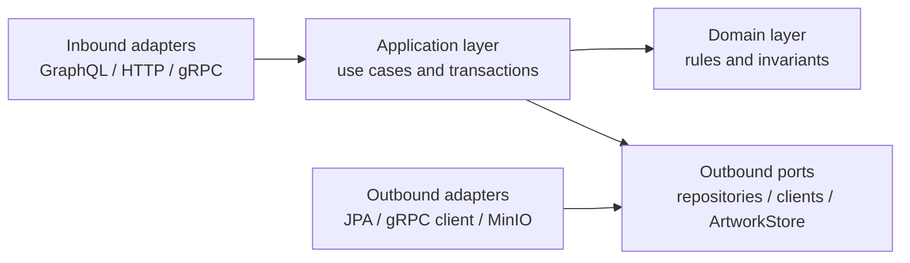
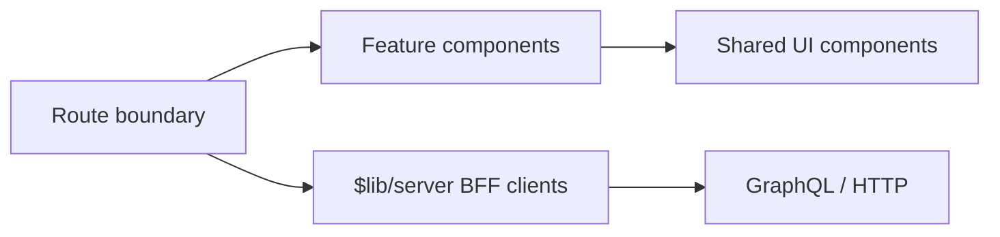

# MovieDB architecture

```yaml
status: current
canonical_for: system-boundaries
last_verified: 2026-09-15
```

Current v1 architecture with the approved v2 evolution. Quality priorities and
technology-choice rationale live here too; data ownership/DDL is in
[data-model.md](data-model.md) and API semantics are in [interfaces.md](interfaces.md).

## Quality priorities

Ordered: 1) correctness and domain clarity, 2) reproducibility, 3) testability,
4) maintainability, 5) good failure behaviour, 6) reasonable performance,
7) evolution (storage/service clients sit behind interfaces — see ADR-4/ADR-14
for why this mattered in practice).

## 1. Architecture at a glance

MovieDB uses a SvelteKit backend-for-frontend (BFF), two Kotlin/Spring Boot services, one PostgreSQL database per service, and shared object storage for binary media. The browser communicates only with SvelteKit. Catalogue data crosses the public application boundary as GraphQL, service-to-service People operations use gRPC, and image bytes use HTTP endpoints optimized for upload and caching.



MinIO replaces the v1 mounted filesystem volumes in v2. It does not change browser URLs, GraphQL artwork metadata, validation rules, or application use cases because both services depend on the `ArtworkStore` port rather than a concrete storage implementation.

## 2. System boundaries

### Browser

The browser renders Svelte pages and sends navigation, form, search, and media requests to the SvelteKit origin. It never receives internal service addresses or credentials. This creates one trusted web boundary, avoids browser-to-service CORS, and keeps GraphQL and gRPC internal.

### SvelteKit BFF

The BFF owns presentation orchestration:

- `+page.server.ts` loads private/internal data and implements form actions.
- `+page.svelte` renders the returned page model and manages local interaction state.
- `routes/api/**/+server.ts` provides same-origin endpoints for live search and streamed media.
- `$lib/server` contains the GraphQL client, typed operations, error translation, request context, and media proxy.

This layer adapts backend contracts for the UI; it must not contain catalogue business rules or access a database. Shared server helpers prevent every route from reimplementing correlation IDs, error handling, and media headers.

### Catalogue Service

Catalogue owns movies, genres, credits, comments, and movie-artwork metadata. It exposes GraphQL for application data and dedicated HTTP media endpoints for image bytes. It also orchestrates cross-service workflows such as validating or hydrating People references.

It stores only a `personId` in a credit. Names, biographies, and photos remain People-owned. This prevents duplicated authoritative person data and makes ownership enforceable even though the services cannot share a foreign key.

### People Service

People owns person identity, biography, lifecycle, search, and profile-photo references. Its application contract is internal gRPC; its HTTP surface is limited to operational endpoints and profile-photo transfer.

People deliberately knows nothing about movies or credits. Catalogue protects referenced-person deletion before invoking People. This keeps dependency direction one-way and prevents cross-database queries.

### PostgreSQL databases

Each service owns a database, credentials, Flyway history, JPA entities, and repositories. Transactions are strong only inside one service. Cross-service consistency is managed by orchestration and explicit failure handling, not distributed transactions.

PostgreSQL is appropriate because credits and genres are relational associations with constraints and reverse-query requirements. Separate databases make service ownership real rather than a package-level convention.

### Shared media module and MinIO

The `backend/media` module owns storage-neutral media primitives:

- `ArtworkStore` is the outbound port used by application services.
- `ImageContentValidator` verifies size, magic bytes, and decodability.
- `MinioArtworkStore` is the v2 production/Compose adapter.
- `LocalArtworkStore` remains a fast test adapter, not the deployed store.

Catalogue and People use separate buckets and separate least-privilege service identities. Each identity can operate only on its owning service's bucket and cannot administer buckets or policies. A one-shot infrastructure bootstrap uses the MinIO root identity to provision those resources; root credentials are never passed to an application. This preserves the database ownership model without the operational cost of running two object-storage clusters. Object keys remain server-generated UUID-based keys; client filenames are metadata only.

## 3. Backend layering

Both Kotlin services use package-by-feature with clean dependency direction. These are logical layers rather than separate Gradle modules for every layer; the codebase is small enough that module proliferation would add ceremony without improving isolation.



### Inbound adapters

Examples are GraphQL controllers, HTTP media controllers, and the People gRPC service. Their purpose is to translate transport-specific input into commands, call one application operation, and translate the result back. They own protocol validation and status/error mapping, but not workflow or persistence decisions.

Keeping controllers thin makes the same use case reusable by GraphQL, import tooling, tests, or a future API without duplicating rules. Controllers must not query repositories directly; read composition belongs in an application read service.

### Application layer

Application services implement use cases such as creating a movie, listing filtered movies, adding a credit, replacing artwork, or adding a comment. They coordinate repositories and external ports, define transaction boundaries, order side effects, and apply compensating cleanup where a database transaction cannot include MinIO.

This layer exists because a workflow is more than a domain validation function but should not depend on GraphQL or HTML. Commands are explicit inputs, which keeps transport models from leaking inward.

### Domain layer

The domain layer contains pure rules and domain-specific exceptions: valid dates, required character names, compatible role categories, pagination bounds, and comment constraints. It should be testable without Spring, PostgreSQL, MinIO, or network access.

Pure rules make invalid states consistently rejected regardless of which adapter invokes the use case and keep framework concerns from obscuring business meaning.

### Outbound ports

Repositories, `PeopleClient`, and `ArtworkStore` describe capabilities the application needs. Application code depends on these interfaces rather than JPA, a concrete gRPC stub, the filesystem, or the MinIO SDK.

Ports isolate infrastructure changes. The v2 MinIO migration is intentionally an adapter replacement behind `ArtworkStore`, not a rewrite of upload/delete workflows.

### Outbound adapters

Spring Data repositories persist service-owned entities, `PeopleGrpcClient` implements the People port, and `MinioArtworkStore` implements object storage. Adapters own framework configuration, serialization, query details, timeouts, and infrastructure exceptions.

Adapters are tested with the real technology at the boundary: PostgreSQL and MinIO through Testcontainers, GraphQL and gRPC contract tests, and focused unit tests for orchestration failure paths.

## 4. Frontend layering



### Route boundary

Route folders define URLs and route-specific composition. Dynamic folders such as `[id]` are SvelteKit parameters, and reserved files such as `+page.svelte`, `+page.server.ts`, and `+server.ts` are framework entry points. Route files should parse URL/form input and assemble a page, not become general utility modules.

### Feature components

Larger movie- and people-specific presentation units belong in feature-oriented component folders as v2 grows (movie list toolbar, list/grid renderers, credit display, comments). This avoids one oversized route component while keeping code near the feature vocabulary.

### Shared UI components

Reusable, domain-light controls such as confirmation dialogs, state banners, and search boxes live in `$lib/components`. A component should be shared because its behavior is genuinely reused, not merely to make route files shorter.

### Server-only integration

`$lib/server` is the only frontend layer that knows internal URLs or backend protocols. SvelteKit enforces that these modules cannot enter the browser bundle. Typed operation functions provide a small anti-corruption boundary between GraphQL response shapes and page loaders.

## 5. Important request flows

### Movie page read

1. The browser requests `/movies/[id]` from SvelteKit.
2. The server load function calls the Catalogue GraphQL operation.
3. Catalogue application read services load movie-owned data in bounded queries.
4. Distinct person IDs are batch-loaded from People over one gRPC request.
5. Catalogue returns hydrated credits; missing people become explicit unavailable references.
6. SvelteKit renders the page. Images load later through same-origin media proxy routes.

### Media replacement

1. The BFF forwards multipart bytes to the owning service.
2. The service validates the complete image before permanent storage.
3. `ArtworkStore.put` writes a new MinIO object with a generated key.
4. A local database transaction swaps the metadata/profile reference.
5. If the transaction fails, the new object is deleted as compensation.
6. After commit, the old object is deleted. A scheduled orphan sweeper covers retryable cleanup failures.

The database and MinIO cannot share a transaction. Ordering plus compensation gives predictable behavior without pretending to provide distributed atomicity.

### Comment creation (v2)

1. SvelteKit validates required form fields for immediate feedback.
2. Catalogue repeats authoritative validation in the application/domain layers.
3. A Catalogue transaction verifies the movie and inserts the comment with a server timestamp.
4. GraphQL returns the created comment and the page is invalidated or updated.

Comments are Catalogue-owned because their lifecycle and query boundary are the movie aggregate. Authentication remains out of scope, so `authorDisplayName` is submitted text rather than a user-account reference.

## 6. Dependency and consistency rules

- Browser code depends on SvelteKit routes, never backend addresses.
- People never depends on Catalogue.
- Catalogue may depend on the People contract, never the People database or implementation classes.
- Service application/domain packages must not depend on GraphQL, servlet, MinIO, or SvelteKit types.
- A service may write only its own database and media bucket.
- Cross-service reads are bounded, timed, and degradation-aware.
- Binary bytes stay outside GraphQL; GraphQL returns metadata and same-origin URLs.
- Database migrations are additive and versioned; v2 changes do not edit an applied v1 migration.

## 7. v2 evolution

V2 preserves the service boundaries and adds capabilities inside them:

| V2 capability | Architectural location |
|---|---|
| MinIO migration | Shared media adapter, per-service configuration, Compose infrastructure |
| Movie genre/year filters | Catalogue query/application/repository plus BFF query parameters |
| Grid/list view | Frontend feature components and URL/local preference state |
| Cast/crew visual redesign | Frontend movie-detail feature components; existing batched hydration |
| Comments | Catalogue migration/entity/repository/application/GraphQL plus movie-detail UI |
| People photos in lists | People response/BFF operation plus existing photo proxy |
| Action/view icons | Frontend resources and accessible controls |

MinIO is the first v2 delivery because every poster/photo feature depends on reliable shared media storage and because implementing it behind the existing port has a small, independently testable blast radius.

The cutover intentionally discards current local demo artwork and reruns the importer into MinIO. The same seed change expands controlled genres and the movie manifest so genre/year filtering has meaningful data.

## 8. Related documentation

- [Code map](code-map.md)
- [Data model](data-model.md)
- [Interfaces](interfaces.md)
- [Requirements](../product/requirements.md)
- [V2 plan](../plans/v2/README.md)
- [Architecture decision records](../decisions/README.md)
