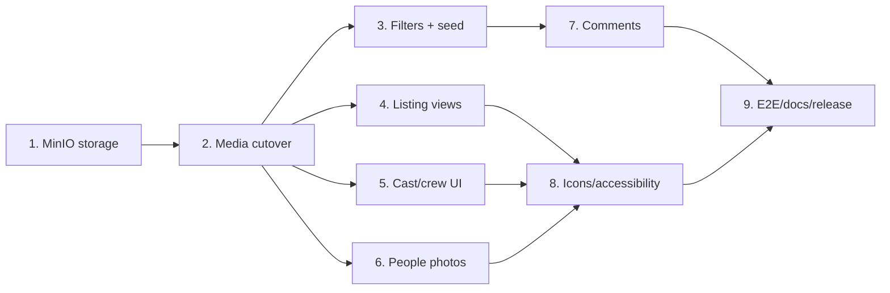

# MovieDB v2 implementation tasks

Status: ready for implementation

Priority rule: MinIO migration is the first v2 delivery
Last updated: 2026-09-13

## 1. Delivery strategy

V2 should be delivered as independently testable vertical slices. Preserve the current public media URLs and service ownership boundaries. A task is complete only when its implementation, automated tests, configuration, and relevant documentation are updated.

Recommended order:

Tasks 3–6 may proceed independently after the MinIO cutover is stable. Comments follow the storage work for sequencing, not because comments technically depend on MinIO.

## 2. Priority 0 — MinIO migration

### V2-01: Add the MinIO storage adapter

**Goal:** implement the existing `ArtworkStore` contract with an S3-compatible MinIO backend.

**Work:**

- Add the pinned MinIO Java SDK dependency to `backend/media`.
- Implement `MinioArtworkStore` with `put`, `open`, `delete`, `exists`, and `listKeys`.
- Generate keys server-side using UUID plus the validated safe extension; never use the client filename.
- Stream uploads/downloads rather than introducing a second full-memory copy in the adapter.
- Compute and return SHA-256 and byte size while storing.
- Map unknown keys to the existing not-found semantics.
- Map connectivity/authentication/backend errors to sanitized storage exceptions; do not expose credentials or internal endpoints.
- Keep object naming flat unless a measured need for prefixes appears.

**Tests:**

- Unit tests for key generation and error mapping.
- MinIO Testcontainers integration tests covering all five store operations, missing keys, repeated delete, listing, and content integrity.
- Adversarial key tests proving traversal-like input cannot address arbitrary objects.

**Done when:** `MinioArtworkStore` passes the same behavioral contract as `LocalArtworkStore`, including orphan enumeration.

### V2-02: Make storage selection configuration-driven

**Goal:** both services use MinIO in Compose while application use cases remain unchanged.

**Work:**

- Introduce explicit properties: storage type, endpoint, access key, secret key, bucket, region, and secure/TLS flag.
- Select `MinioArtworkStore` for the Compose/runtime profile and retain `LocalArtworkStore` for focused local/unit tests.
- Fail startup clearly if MinIO configuration is incomplete or the pre-provisioned service bucket is unavailable/inaccessible. Application credentials must not be allowed to create buckets or policies.
- Give Catalogue and People separate buckets (`catalogue-artwork`, `people-photos`) and separate service identities with least-privilege policies scoped to their own bucket.
- Never place secrets in committed YAML; document them in `.env.example` with development-only defaults supplied through Compose interpolation.
- Add a readiness indicator for object storage without putting MinIO in liveness.

**Tests:**

- Spring context tests prove the correct bean is selected for each storage type.
- Service integration tests run existing upload/replace/serve/delete/orphan scenarios against MinIO.
- Verify a service cannot enumerate, read, write, or delete objects in the other service's bucket.

**Done when:** Catalogue and People start with MinIO and no caller knows which concrete store is active.

### V2-03: Add MinIO to Docker Compose and cut over runtime storage

**Goal:** local setup uses reproducible object storage instead of service-local artwork volumes.

**Work:**

- Add a pinned MinIO service with API and optional development console ports.
- Add a health check and a one-shot administrative initialization service that idempotently creates buckets, service identities, and scoped policies before application startup.
- Make Catalogue and People depend on MinIO readiness.
- Remove `catalogue-artwork-data` and `person-artwork-data` mounts from the service containers after integration tests pass.
- Add a named MinIO data volume and update setup/reset scripts to manage only this project's named volume.
- Update importer smoke tests to prove seeded posters and profile photos survive service-container recreation.
- Document backup/export implications and the local-to-MinIO transition.

**Confirmed migration decision:** discard the current local artwork data during cutover, reset affected metadata/data, and rerun the deterministic importer so posters and person photos are stored in MinIO. Database rows that reference discarded local keys must not be retained against an empty MinIO instance.

**Done when:** a fresh setup, restart, seed, retrieval, replacement, deletion, and orphan sweep all operate through MinIO; deployed services no longer mount local artwork directories.

### V2-04: MinIO failure and rollback verification

**Goal:** preserve v1 media safety under object-storage failure.

**Work:**

- Verify a failed database metadata swap compensates by deleting the newly uploaded object.
- Verify old objects are deleted only after database commit.
- Verify orphan sweep tolerates pagination and transient object-store failure.
- Confirm metadata-with-missing-object returns `404`, not `500`.
- Confirm `ETag`, cache headers, content type, content length, and `nosniff` behavior are unchanged.
- Add metrics/logging for MinIO operation failures, compensation failures, and orphan sweep outcomes.
- Document rollback: switch configuration back only when the referenced objects exist in the selected backend.

**Done when:** all existing media contract tests pass against MinIO and failure-path tests demonstrate no silent metadata corruption.

## 3. Priority 1 — Movie filters and expanded seed content

### V2-05: Extend the movie-list GraphQL contract

- Add `MovieFilterInput { genreCode, releaseYear }` and an optional `filter` argument to `movies`.
- Validate genre codes against controlled reference data and validate a bounded four-digit release year.
- Add repository/application queries that combine genre and year with AND semantics.
- Preserve exact `total`, arbitrary offset behavior, stable ordering, and the 1–100 limit clamp.
- Avoid duplicate movie rows when filtering through `movie_genre`.
- Add repository and GraphQL integration tests for genre-only, year-only, combined, cleared, empty, and paginated results.

### V2-06: Add filter controls to `/movies`

- Load active genres and available/configured year choices.
- Store filter state in query parameters so results are linkable and browser navigation works.
- Reset `offset=0` whenever a filter changes; retain filters during pagination.
- Display the matching total and a specific no-results state.
- Update `$lib/server` types/operations and add component/route tests.

### V2-07: Expand deterministic demo content

- Add an append-only Flyway reference-data migration and matching importer mappings for a useful breadth of genres. At minimum include Action, Comedy, Crime, Drama, Horror, Mystery, Romance, and Thriller; retain Psychological Horror as the existing editorial genre.
- Extend the committed TMDB ID manifest to cover the expanded genre set and several release years.
- Keep importer concurrency, mappings, retry behavior, and idempotency unchanged.
- Add assertions that the seeded set makes both filters demonstrable.
- Do not commit downloaded JSON or images; all image bytes go to MinIO through service endpoints.

## 4. Priority 2 — Movie listing presentation

### V2-08: Introduce movie-list feature components

- Extract a movie-list toolbar, cluster renderer, list renderer, and movie poster fallback under `$lib/features/movies`.
- Keep the route responsible for URL state and data loading; keep renderers free of backend calls.
- Preserve current cards as the default cluster view.

### V2-09: Implement cluster/list view switching

- Provide accessible cluster and list controls using the supplied SVG resources.
- Render list rows with poster, title, release year, genres, and truncated synopsis.
- Switch without fetching a different page or changing the current offset.
- Default to cluster. Persist preference in a `view` query parameter or progressive-enhancement-safe local preference; query parameters are preferred for deterministic SSR.
- Add responsive behavior, placeholder behavior, accessible names, keyboard focus, and component tests.

## 5. Priority 3 — Detail and people presentation

### V2-10: Build the movie cast/crew presentation

- Extract `CreditPersonRow` and cast/crew section components.
- Show photo left; name and character/role title right.
- Use person-photo proxy URLs and the shared placeholder.
- Keep cast ordered by billing order with deterministic null/tie handling.
- Render unavailable People references explicitly without failing the movie page.
- Confirm person hydration remains one batched gRPC operation per request; add regression coverage.

### V2-11: Add photos to the People listing

- Extend the People list projection/GraphQL shape with a nullable same-origin `photoUrl` (or sufficient profile-photo state for the BFF to construct it).
- Render a linked person row with photo left and name right.
- Preserve search, pagination, total count, missing-photo fallback, and keyboard navigation.
- Add People contract, GraphQL, route, and component tests.

### V2-12: Apply action icons consistently

- Introduce a small accessible icon-control component or a consistent inline-SVG pattern.
- Replace credit edit/delete text controls where required, while retaining explicit accessible names and tooltips where useful.
- Keep movie deletion a labeled destructive confirmation, never an icon-only action.
- Verify focus return, confirmation behavior, contrast, target size, and screen-reader names.

## 6. Priority 4 — Movie comments

### V2-13: Add the comment persistence model

- Add an append-only Catalogue Flyway migration for `movie_comment`.
- Suggested fields: UUIDv7 `id`, `movie_id` FK with `ON DELETE CASCADE`, `author_display_name`, `text`, and `created_at`.
- Add an index on `(movie_id, created_at DESC, id DESC)`.
- Use a required trimmed author display name limited to 50 Unicode characters and comment text limited to 2,000 characters.
- Comments are physically deleted with their movie; standalone comment edit/delete is not in v2 scope.
- Add entity, repository, rules, and PostgreSQL integration tests.

### V2-14: Add the comment application and GraphQL API

- Add `comments(movieId, page)` and `addMovieComment(movieId, input)` to the GraphQL contract.
- Use server-generated UUIDv7 and timestamps; never trust a client timestamp.
- Return reverse chronological pages with stable ID tie-breaking and bounded limits.
- Validate that the movie exists and map failures through stable GraphQL error codes.
- Keep comment reads/writes inside Catalogue; do not introduce another service.
- Add application and GraphQL integration tests for empty, whitespace, over-limit, missing movie, ordering, pagination, and movie cascade deletion.

### V2-15: Add the movie-detail comment UI

- Add a comment list, empty state, and progressively enhanced submission form.
- Display author, text, and localized timestamp while retaining a machine-readable `<time datetime>` value.
- Reject empty input client-side for feedback and retain server-side validation as authoritative.
- Preserve entered values after a failed action and prevent duplicate submission.
- Refresh or append after success without disturbing movie-detail state.
- Add component, action, accessibility, and E2E coverage.

## 7. Priority 5 — Release hardening

### V2-16: Cross-feature accessibility and responsive review

- Test icon names, dialogs, focus behavior, heading order, alt text, keyboard navigation, contrast, and reduced motion.
- Exercise cluster/list, filters, credit rows, People rows, and comments at mobile and desktop widths.
- Add automated checks where stable and record any manual verification.

### V2-17: End-to-end and operational verification

- Extend the Playwright journey to cover filters, view switching, photo rendering, comment creation, and credit icon actions.
- Add a Compose smoke test covering MinIO readiness and media persistence across service restart.
- Run backend tests, frontend checks/tests/build, importer tests, container builds, and clean-clone setup.
- Confirm no backend address, MinIO credential, or object-store URL leaks into browser code.

### V2-18: Documentation and release checklist

- Update README setup/configuration/reset/backup instructions for MinIO.
- Keep `architecture.md`, `code_structure.md`, technical specification, requirements, and ADRs synchronized.
- Record the MinIO decision in ADR-14 and any later hard-to-reverse v2 decisions in new ADRs.
- Mark v2 acceptance criteria with test/evidence links after implementation.

## 8. Confirmed design decisions

1. Discard v1 local artwork during MinIO cutover and deterministically reseed posters/profile photos into MinIO.
2. Use one MinIO deployment with separate service-owned buckets and separate least-privilege application identities. The root/admin identity is used only for bootstrap administration and is never supplied to an application service.
3. Expand the controlled genre seed and TMDB mapping together, then select a broader deterministic movie manifest that exercises those genres and multiple years.
4. Comments use an unauthenticated display name because authentication remains out of scope.
5. Display names are trimmed and limited to 50 Unicode characters; comment text is limited to 2,000 characters.
6. V2 comments can be created and read but not edited or individually deleted.
