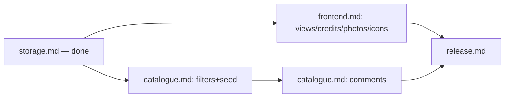

# V2 plan

```yaml
status: current
canonical_for: v2-backlog
last_verified: 2026-09-15
```

Delivered as independently testable vertical slices. Preserve current public
media URLs and service ownership boundaries. A task is complete only when its
implementation, automated tests, configuration, and relevant documentation are
updated — then move its row here to ✅ and update [verification/v2-acceptance.md](../../verification/v2-acceptance.md).

## Status and dependency map



| Area | File | Status |
|---|---|---|
| MinIO storage adapter, config-driven selection, Compose cutover, failure/rollback verification | [storage.md](storage.md) | ✅ done |
| Movie filters, expanded seed, comment persistence/GraphQL API | [catalogue.md](catalogue.md) | ✅ done |
| View toggle, cast/credits presentation, people photos, action icons | [frontend.md](frontend.md) | ✅ done |
| E2E, accessibility, Compose smoke test, docs/release checklist | [release.md](release.md) | ☐ not started (blocked on the above) |

Filters/frontend/photos may proceed independently now that MinIO is stable.
Comments are sequenced after filters for planning convenience, not because
comments technically depend on storage or filtering.

**Gap**: [requirements.md](../../product/requirements.md) requirement 5
(Movie Comment Section) also calls for a Movie Detail UI that lists comments
and lets a user submit one — catalogue.md's V2-13/V2-14 only deliver the
backend persistence and GraphQL API. No frontend task for the comment section
exists yet in frontend.md; one needs to be added before requirement 5 as a
whole can be marked done.

## Confirmed design decisions

1. Discarded v1 local artwork during MinIO cutover and deterministically
   reseeded posters/profile photos into MinIO.
2. One MinIO deployment, separate service-owned buckets, separate
   least-privilege application identities; root/admin identity is bootstrap-only.
3. Expand the controlled genre seed and TMDB mapping together, then broaden the
   deterministic movie manifest to exercise those genres and multiple years.
4. Comments use an unauthenticated display name because authentication remains
   out of scope; names limited to 50 Unicode characters, text to 2,000.
5. V2 comments can be created and read but not edited or individually deleted.
6. Credit mutation (add/remove) lives only inside the Credit Editor, reached
   via an edit Icon Asset control on the movie/person detail page — matching
   the pre-existing read-only-detail-page structure. There is no separate
   per-Credit edit control for changing an existing credit's
   role/character/billing; add + remove together are the editing capability.
7. Removing a credit does not require confirmation: the person's data is
   untouched and the credit can be re-added at any time with no re-entry of
   data. Movie/person deletion keep their own labeled confirmation dialogs,
   never icon-only, because they destroy substantial hand-entered data that
   is materially harder to reconstruct.
