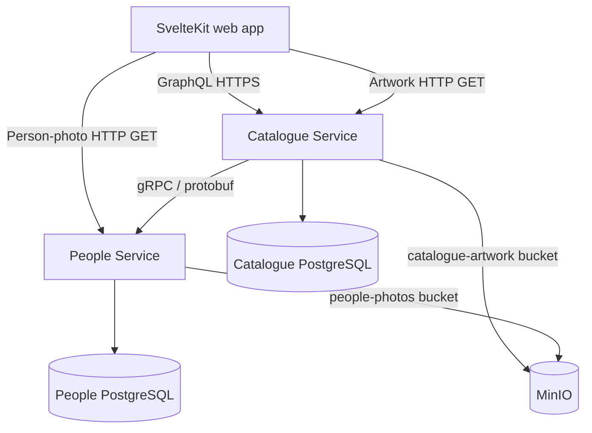
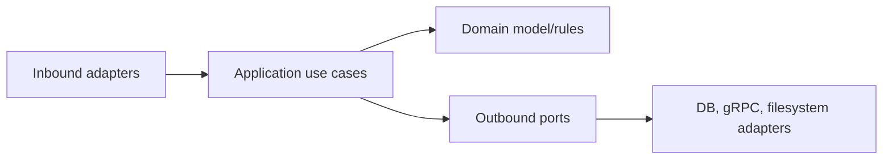
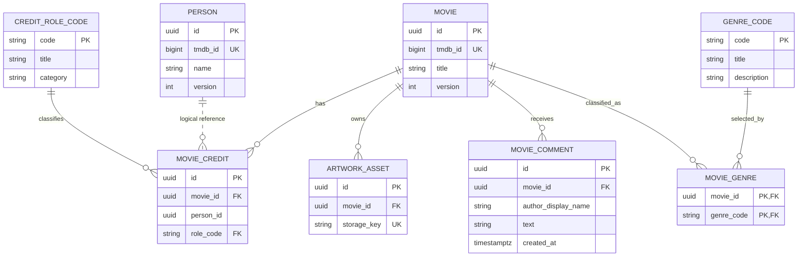

# Movie Catalogue — Technical Specification

Version: 0.2 (v2 design revision; filename retained for stable links)

Status: v1 implemented; v2 proposed
Audience: assessor, implementer, and interview panel
Last updated: 2026-09-13

## 1. Executive summary

Build a movie catalogue with a SvelteKit/TypeScript web application and two Kotlin/Spring Boot services:

- **Catalogue Service** owns movies, movie credits, artwork metadata/storage, the public GraphQL API, and cross-service orchestration.
- **People Service** owns people and exposes an internal gRPC API.

Each service owns its own PostgreSQL database. The browser talks to the SvelteKit server (a backend-for-frontend, BFF); SvelteKit server routes call the Catalogue GraphQL API server-side. GraphQL is therefore not exposed directly to the browser: this removes browser-to-backend CORS, keeps the GraphQL endpoint on the internal network, and lets a correlation ID propagate server-side from the SvelteKit route into GraphQL and onward into gRPC. Catalogue application data and operations use GraphQL. Catalogue-to-People communication uses gRPC. Artwork upload and retrieval use HTTP media endpoints because streaming, multipart transfer, range/caching semantics, and binary responses are a better fit for HTTP than GraphQL; GraphQL returns the artwork metadata and URL.

Demo data is not committed to Git. A deterministic setup task reads a small committed list of TMDB movie IDs, downloads the corresponding movie details, selected credits, people, and posters, and imports them through application interfaces. Re-running it is safe.

V2 retains the service boundaries while adding movie filters, grid/list presentation, richer cast and People imagery, comments, accessible action icons, and MinIO object storage. Kafka, Redis, Elasticsearch, Kubernetes, authentication, and public-cloud deployment remain out of scope because the stated workload does not justify them. MinIO is intentionally introduced behind the existing `ArtworkStore` port as a local S3-compatible deployment dependency.

## 2. Scope

### 2.1 MVP functional scope

| Capability | Behaviour / acceptance criterion |
|---|---|
| List movies | Paginated movie cards with poster, title, year, and summary |
| View movie | Movie details display cast and creators ordered predictably |
| Create movie | Valid data creates one movie and returns its generated ID |
| Edit movie | Existing movie fields can be updated; stale edits are rejected |
| Delete movie | Confirmation required; movie credits and owned artwork are removed |
| Upload artwork | JPEG, PNG, or WebP; validated type/size; old artwork safely replaced |
| List people | Paginated people list with search |
| View person | Person details plus their movie credits |
| Create/edit person | Person lifecycle is managed independently of movie credits |
| Delete person | Rejected while the person has movie credits; succeeds once unreferenced |
| Manage credits | Add an existing person to a movie, edit their credit, or remove the association |
| Classify movies | Assign one or more controlled genre codes to a movie |
| Search | One debounced search finds movie titles and people; movie results also include movies credited to matching people |
| Demo setup | One documented command starts dependencies and imports deterministic TMDB data |
| Tests | Unit tests cover business rules and edge cases; integration tests cover DB/API boundaries; one small E2E happy path |

### 2.2 V2 functional scope

| Capability | Behaviour / acceptance criterion |
|---|---|
| MinIO artwork | Movie posters and person photos use MinIO through `ArtworkStore` without changing public media behavior |
| Movie filters | Genre and exact release-year filters combine with AND semantics, reset offset, and return an accurate matching total |
| Listing view | Users switch between the default poster cluster and a detailed list without changing the current result page |
| Cast and credits | Movie detail shows person photo, name, and character/role with ordered cast and unavailable-person fallback |
| Comments | Users read and add reverse-chronological movie comments with server-side validation and timestamps |
| People imagery | People listing rows include a profile photo or placeholder while preserving search and pagination |
| Action icons | Credit edit/delete and listing view controls use consistent accessible SVG icons; movie deletion stays explicitly labeled |
| Expanded seed | Deterministic TMDB content spans enough genres and years to demonstrate filters |

### 2.3 Deliberate domain semantics

- A **Person** exists independently of any movie.
- A **MovieCredit** represents a person's role in one movie. Role is not a property of the person alone.
- Removing a person on a movie page removes only the credit, never the person.
- Creating a credit requires selecting an existing person. If none exists, the user creates the person first on the People page.
- A **CreditRoleCode** supplies a stable role code, display title, category, and definition. The selected role is stored on `MovieCredit`, not directly on `Person`.
- A **GenreCode** is controlled reference data connected to movies through `MovieGenre`.
- Codes are stable identifiers; titles and descriptions may evolve without rewriting relationships.
- A person page can display or filter roles derived from the person's credits. A separate `person_role` table is not created because it would duplicate or contradict actual credits.
- `CAST` and `CREW` remain broad role categories. Character and source-specific job details remain on the credit rather than becoming fixed movie columns such as `director`, `mainMaleLead`, or `supportingCast`.
- A person may hold several credits on the same movie, such as writer and director, or may portray multiple characters.
- People with active credits cannot be deleted. This avoids surprising, cross-catalogue data loss.
- A **Comment** belongs to one movie and is physically deleted with it. Without authentication, `authorDisplayName` is submitted display text rather than an account reference.
- Comment timestamps and IDs are generated by Catalogue; clients cannot choose ordering metadata.

### 2.4 Out of scope unless the assessor says otherwise

- Authentication, authorization, accounts, and multi-tenancy
- Ratings, watchlists, recommendations, and TV programmes
- Comment editing, individual comment deletion, reactions, threading, moderation, and account identity
- Internationalized catalogue content
- Audit-history UI and restoring deleted records
- Real-time collaboration or notifications
- Dedicated search engine, distributed cache, message broker, Kubernetes, or public-cloud deployment
- Video upload/streaming and image editing
- Production-grade TMDB synchronization after initial setup

### 2.5 Optional enhancements, only after v2 is complete

- Inline “create person and return” flow from the movie editor
- Responsive image variants/thumbnails
- Accessibility test automation
- OpenTelemetry traces and dashboards
- Soft deletion/audit trail if a retention requirement is confirmed
- Presigned object-storage delivery/CDN integration

## 3. Assessor guidance and resulting decisions

The assessor explicitly left these matters to candidate judgement. The implementation therefore records decisions rather than adding every optional feature.

| Topic | Assessor guidance | Decision for this submission |
|---|---|---|
| Artwork protocol | Candidate may decide whether GraphQL is appropriate | Use multipart HTTP upload and cacheable HTTP retrieval; return metadata/URL through GraphQL |
| Authentication/authorization | Include only if considered essential | Out of scope because no users, roles, identity provider, or permission rules are specified; retain baseline security hygiene |
| Scale/performance | State assumptions and sensible targets | Adopt the bounded workload and latency targets below; use pagination, indexes, batching, and deadlines |
| Retention/auditing/restoration | Include only if considered essential | No retention requirement; use physical deletion with confirmation and reference protection |
| Testing | Unit tests expected; integration/E2E welcomed | Thorough unit tests plus targeted PostgreSQL, GraphQL, gRPC, artwork integration tests and one critical Playwright journey |

The priority is complete required behaviour, reproducible setup, and evidence-backed engineering choices. Optional infrastructure is not a substitute for a finished core workflow.

### 3.1 Working assumptions

| Area | Baseline assumption |
|---|---|
| Scale | Under 100,000 movies, 500,000 people, and 100 concurrent interactive users |
| Performance | p95 under 500 ms for normal reads on a warm local system; search under 750 ms |
| Artwork | Maximum 5 MiB per upload; JPEG/PNG/WebP only |
| Availability | Local assessment system; no formal SLA |
| Consistency | Strong within one service transaction; no distributed transaction across services |
| Security | Trusted local user; secrets still remain outside Git |
| Deletion | No legal/audit retention; physical deletion where safe |
| Browser API | GraphQL for application data; HTTP multipart upload and HTTP GET for artwork bytes |
| Deployment | Reproducible local execution via Docker Compose is required; v2 Compose uses MinIO object storage |

### 3.2 Questions asked and resolved

Ask only questions that materially change scope or architecture:

1. Is authentication/authorization in scope, or may the application assume an authorized user?
2. Does the GraphQL requirement include binary artwork upload/retrieval, or may binary content use an HTTP media endpoint while metadata and mutations use GraphQL?
3. Are there expected scale/performance targets, catalogue sizes, or artwork-size limits?
4. Are there requirements to retain, audit, or restore deleted records?
5. Does “complete unit test cases” intentionally mean unit tests only, or will integration/E2E coverage also be assessed?

The assessor delegated each decision. Everything below must therefore be presented as an explicit, proportionate engineering choice rather than as a hidden requirement.

### 3.3 Confirmed v2 decisions

1. Discard existing v1 local artwork during MinIO cutover, clear stale media references/data, and deterministically reseed posters/profile photos into MinIO.
2. Use one MinIO deployment with separate Catalogue and People buckets and separate least-privilege application identities. Never give either service the root/admin identity.
3. Authentication remains out of scope, so a comment stores a required author display name rather than a user ID.
4. Comment author names are trimmed and limited to 50 Unicode characters; comment text is limited to 2,000 characters.
5. V2 supports comment creation and reading, but not editing or individual deletion.
6. Expand the controlled genre reference data, importer mapping, and deterministic movie manifest together so the seed demonstrates genre and year filters.

If a future deployment contains irreplaceable media, it requires a separate copy-and-verify migration rather than relying on this demo cutover. If authenticated comments or comment mutation are later required, identity, authorization, retention, and moderation must be designed first.

## 4. Quality attributes and priorities

Ordered priorities:

1. **Correctness and domain clarity** — credits and person lifecycles cannot be confused.
2. **Reproducibility** — a reviewer can clone, configure one secret, and run the system.
3. **Testability** — domain logic is separated from frameworks; real PostgreSQL is used in integration tests.
4. **Maintainability** — service ownership and contracts are explicit.
5. **Good failure behaviour** — validation and dependency failures are visible and actionable.
6. **Reasonable performance** — pagination, indexes, batching, deadlines, and bounded uploads.
7. **Evolution** — storage and service clients sit behind interfaces.

## 5. Technology stack

Exact patch versions must be pinned in Gradle lockfiles and `package-lock.json` at implementation time.

| Layer | Choice | Why it fits |
|---|---|---|
| UI | Svelte 4.2 + SvelteKit 2 | Current pinned, Node-compatible Svelte stack; concise reactive UI and file-based routing |
| Frontend language | TypeScript (strict) | Required; catches contract/state mistakes early |
| Frontend build | Vite | Native SvelteKit toolchain and fast feedback |
| GraphQL client | `graphql-request` plus generated types | Small surface for an assessment; avoids a large normalized-cache layer that is not needed |
| Backend | Spring Boot 3.5.x baseline | Mature Kotlin, GraphQL, validation, data, health, and testing integration; conservative Java 21-compatible line |
| Backend language | Kotlin | Required; null safety and concise domain/application code |
| JVM | Java 21 LTS | Stable LTS baseline and broadly supported tooling |
| Build | Gradle Kotlin DSL, multi-project | Consistent Kotlin tooling and shared protobuf generation |
| Public API | Spring for GraphQL | Required GraphQL boundary with Spring-native wiring |
| Internal API | gRPC Java/Kotlin + Protocol Buffers | Required efficient, typed service-to-service contract |
| Persistence | Spring Data JPA + Hibernate | Productive CRUD and transaction mapping for a compact relational domain |
| Database | PostgreSQL | Relationships, constraints, transactions, indexing, `ILIKE`/trigram growth path, mature containers |
| Migrations | Flyway | Versioned, reviewable schema changes; production and tests use the same migrations |
| Artwork | MinIO behind `ArtworkStore` | S3-compatible, container-restart-safe object storage while preserving storage independence |
| Media test adapter | `LocalArtworkStore` | Fast isolated contract/unit tests without making filesystem storage the deployed default |
| Backend unit tests | JUnit 5 + MockK + AssertJ | Kotlin-friendly isolation and readable assertions |
| Backend integration | Spring Boot Test + Testcontainers PostgreSQL + gRPC in-process tests | Tests actual dialect, migrations, repositories, and boundaries |
| Frontend tests | Vitest + Svelte Testing Library | Fast component/user-behaviour tests |
| E2E | Playwright | Small number of browser-level critical-flow tests |
| Packaging | Docker + Docker Compose | Reproducible reviewer setup and service topology |
| Observability | Actuator, structured JSON logs, correlation ID | Enough diagnostics without an observability platform |

### Why PostgreSQL, not “SQL because it is popular”

Movies and people have a many-to-many relationship whose relationship carries data: controlled role code, category, character, source job label, and billing order. That is a natural associative relational entity. PostgreSQL provides strong constraints and transactional CRUD and fits the search/index needs. MySQL would also be valid; PostgreSQL is a preference, not a requirement. MongoDB would be reasonable if the dominant unit were a self-contained movie document with rare reverse queries, but this system searches people, traverses both directions, and separately owns people.

### Why JPA here

The domain is small and CRUD-heavy. JPA removes repetitive persistence plumbing, while explicit repository queries are used for search/pagination to avoid accidental N+1 behaviour. jOOQ would offer tighter SQL control but would add code-generation and mapping weight without a demonstrated need.

## 6. System architecture



### 6.1 Catalogue Service responsibilities

- Public GraphQL schema and resolver entry points
- Movie CRUD, filtering, and validation
- Movie-credit CRUD and ordering
- Comment persistence and movie-scoped ordering
- Artwork validation, metadata, object-storage coordination, and download
- Search orchestration across movies and people
- Batch hydration of people for movie responses
- Person deletion workflow: check local credits, then call People Service
- Translation between GraphQL models, domain objects, persistence entities, and protobuf messages

It must not persist authoritative person fields such as names or biographies.

### 6.2 People Service responsibilities

- Person CRUD, validation, search, and profile-photo reference ownership
- Authoritative people database
- gRPC endpoints for single/batch lookup, search, create/update/delete, and health

It does not query the Catalogue database or know how movie credits are stored.

### 6.3 Why two services

The split reflects lifecycle and ownership:

- People can exist before and independently of movies.
- Credits belong to a movie aggregate but refer logically to People-owned IDs.
- gRPC is needed for a genuine use case: validating and hydrating cross-service references.

The trade-off is deliberate: this is more operationally complex than a modular monolith and cross-service integrity cannot be enforced with a foreign key. In a real small product, a modular monolith might be the better default. Two services are used because the assessment explicitly asks for them and because these boundaries are defensible.

### 6.4 Layering inside each service



Package-by-feature is preferred over one global `controller/service/repository` bucket. Framework annotations remain at adapters and application boundaries. Domain rules should be unit-testable without Spring.

Layer purposes and dependency rules are normative in `docs/architecture.md`; concrete package/file placement is documented in `docs/code_structure.md`. Inbound adapters translate protocols, application services coordinate use cases and transactions, the domain holds pure rules, outbound ports describe required capabilities, and infrastructure adapters implement those ports. GraphQL/HTTP/gRPC controllers must not coordinate repositories directly.

### 6.5 Request lifecycle: movie details

1. Browser requests `/movies/{id}`.
2. SvelteKit sends a GraphQL query for the fields needed by the page.
3. Catalogue GraphQL resolver delegates to `GetMovieDetails`.
4. Catalogue repository loads the movie, credits, and artwork metadata in bounded queries.
5. The use case extracts distinct person IDs.
6. One batched `GetPeople` gRPC call is made with a deadline.
7. People Service queries its database in one `WHERE id IN (...)` query.
8. Catalogue maps people onto credits and returns the GraphQL projection.
9. Missing person IDs are represented as unavailable references and logged, rather than failing the whole movie page.
10. Svelte renders data and loads poster bytes from the media URL.

No gRPC call is made per credit. Batching avoids the N+1 network problem.

### 6.6 Request lifecycle: adding a credit

1. UI selects an existing person, a controlled role code, and any role-specific character/order data.
2. GraphQL validates shape and required fields.
3. Catalogue calls `GetPerson` via gRPC to validate the logical reference.
4. A Catalogue DB transaction inserts the credit subject to uniqueness constraints.
5. The new credit is returned with hydrated person data.

There is no atomic transaction covering both services. The person can theoretically be deleted after validation and before insertion. For the assessment, person deletion is orchestrated through the Catalogue GraphQL API and rejected when referenced, making the race very small. At production scale, use a durable person-deletion workflow/event with idempotent consumers rather than a distributed database transaction.

## 7. Data design

### 7.1 Ownership model



The dotted Person-to-Credit relationship is logical. There is no cross-service database foreign key.

**Primary key strategy: application-generated UUIDv7.** All primary keys are UUIDs generated in application (Kotlin) code as UUIDv7 (time-ordered) at entity creation; the database column type stays `UUID` with no DB-side default (do not use `gen_random_uuid()`, which is random UUIDv4). Rationale: UUIDv7 embeds a millisecond timestamp prefix, so newly inserted keys are near-monotonic. This reduces B-tree index fragmentation and page splits, improves insert locality, and makes recent-record range scans more efficient than random UUIDv4 keys — a low-cost, defensible choice regardless of the assessment-sized workload. The external `tmdb_id` remains a nullable provenance column, never the primary key, so user-created data works without TMDB.

### 7.2 Catalogue database DDL

```sql
CREATE TABLE movie (
    id UUID PRIMARY KEY,
    tmdb_id BIGINT UNIQUE,
    title VARCHAR(300) NOT NULL,
    original_title VARCHAR(300),
    synopsis TEXT NOT NULL DEFAULT '',
    release_date DATE,
    runtime_minutes INTEGER CHECK (runtime_minutes IS NULL OR runtime_minutes > 0),
    original_language VARCHAR(10),
    version BIGINT NOT NULL DEFAULT 0,
    created_at TIMESTAMPTZ NOT NULL DEFAULT now(),
    updated_at TIMESTAMPTZ NOT NULL DEFAULT now()
);

CREATE TYPE credit_category AS ENUM ('CAST', 'CREW');

CREATE TABLE credit_role_code (
    code VARCHAR(50) PRIMARY KEY,
    title VARCHAR(100) NOT NULL,
    category credit_category NOT NULL,
    department VARCHAR(100),
    description TEXT NOT NULL,
    active BOOLEAN NOT NULL DEFAULT true,
    display_order INTEGER NOT NULL DEFAULT 0,
    UNIQUE (code, category),
    CHECK (code ~ '^[A-Z][A-Z0-9_]*$')
);

CREATE TABLE genre_code (
    code VARCHAR(50) PRIMARY KEY,
    tmdb_id BIGINT UNIQUE,
    title VARCHAR(100) NOT NULL UNIQUE,
    description TEXT NOT NULL,
    active BOOLEAN NOT NULL DEFAULT true,
    display_order INTEGER NOT NULL DEFAULT 0,
    CHECK (code ~ '^[A-Z][A-Z0-9_]*$')
);

CREATE TABLE movie_genre (
    movie_id UUID NOT NULL REFERENCES movie(id) ON DELETE CASCADE,
    genre_code VARCHAR(50) NOT NULL REFERENCES genre_code(code),
    PRIMARY KEY (movie_id, genre_code)
);

CREATE TABLE movie_credit (
    id UUID PRIMARY KEY,
    movie_id UUID NOT NULL REFERENCES movie(id) ON DELETE CASCADE,
    person_id UUID NOT NULL,
    role_code VARCHAR(50) NOT NULL,
    category credit_category NOT NULL,
    character_name VARCHAR(300),
    source_role_name VARCHAR(150),
    billing_order INTEGER CHECK (billing_order IS NULL OR billing_order >= 0),
    tmdb_credit_id VARCHAR(100),
    created_at TIMESTAMPTZ NOT NULL DEFAULT now(),
    updated_at TIMESTAMPTZ NOT NULL DEFAULT now(),
    FOREIGN KEY (role_code, category)
      REFERENCES credit_role_code(code, category),
    CHECK (
      (category = 'CAST' AND character_name IS NOT NULL)
      OR
      (category = 'CREW' AND character_name IS NULL)
    )
);

CREATE UNIQUE INDEX uq_movie_credit_tmdb
    ON movie_credit (movie_id, tmdb_credit_id)
    WHERE tmdb_credit_id IS NOT NULL;

CREATE UNIQUE INDEX uq_movie_credit_manual
    ON movie_credit (
      movie_id,
      person_id,
      role_code,
      COALESCE(character_name, '')
    );

CREATE INDEX ix_movie_title_lower ON movie (lower(title));
CREATE INDEX ix_movie_genre_genre ON movie_genre (genre_code, movie_id);
CREATE INDEX ix_credit_movie_order ON movie_credit (movie_id, category, role_code, billing_order);
CREATE INDEX ix_credit_person ON movie_credit (person_id);
CREATE INDEX ix_credit_person_role ON movie_credit (person_id, role_code);

CREATE TABLE artwork_asset (
    id UUID PRIMARY KEY,
    movie_id UUID NOT NULL REFERENCES movie(id) ON DELETE CASCADE,
    storage_key VARCHAR(500) NOT NULL UNIQUE,
    original_filename VARCHAR(255) NOT NULL,
    media_type VARCHAR(100) NOT NULL,
    byte_size BIGINT NOT NULL CHECK (byte_size > 0 AND byte_size <= 5242880),
    sha256 CHAR(64) NOT NULL,
    width INTEGER CHECK (width IS NULL OR width > 0),
    height INTEGER CHECK (height IS NULL OR height > 0),
    created_at TIMESTAMPTZ NOT NULL DEFAULT now()
);

CREATE UNIQUE INDEX uq_movie_primary_artwork ON artwork_asset (movie_id);

-- V2: add in a new Flyway migration; do not edit the applied V1 migration.
CREATE TABLE movie_comment (
    id UUID PRIMARY KEY,
    movie_id UUID NOT NULL REFERENCES movie(id) ON DELETE CASCADE,
    author_display_name VARCHAR(50) NOT NULL,
    text VARCHAR(2000) NOT NULL,
    created_at TIMESTAMPTZ NOT NULL DEFAULT now(),
    CHECK (length(btrim(author_display_name)) BETWEEN 1 AND 50),
    CHECK (length(btrim(text)) BETWEEN 1 AND 2000)
);

CREATE INDEX ix_movie_comment_movie_created
    ON movie_comment (movie_id, created_at DESC, id DESC);

INSERT INTO credit_role_code
  (code, title, category, department, description, display_order)
VALUES
  ('ACTOR', 'Cast Member', 'CAST', 'Acting',
   'Performs one or more characters in the movie.', 10),
  ('DIRECTOR', 'Director', 'CREW', 'Directing',
   'Leads the movie''s creative interpretation and directs its production.', 20),
  ('WRITER', 'Writer', 'CREW', 'Writing',
   'Develops the story, screenplay, or other written material used by the production.', 30),
  ('PRODUCER', 'Producer', 'CREW', 'Production',
   'Coordinates business and production responsibilities such as financing, staffing, schedule, and delivery; the exact remit varies by production.', 40);

INSERT INTO genre_code
  (code, tmdb_id, title, description, display_order)
VALUES
  ('HORROR', 27, 'Horror',
   'A genre intended primarily to evoke fear, dread, shock, or unease.', 10),
  ('PSYCHOLOGICAL_HORROR', NULL, 'Psychological Horror',
   'A horror subgenre emphasizing mental or emotional distress, identity, perception, paranoia, or unreliable experience over primarily physical threats.', 20);
```

Notes:

- UUIDs are internal identifiers; `tmdb_id` is nullable external provenance, not the primary key. User-created data therefore works without TMDB.
- `tmdb_credit_id` makes imports idempotent. The second index prevents duplicate manual associations.
- Genre and role tables are reference/code tables maintained initially through Flyway. `active = false` retires a code without invalidating historical rows.
- Prefer self-describing codes such as `PRODUCER` and `PSYCHOLOGICAL_HORROR` over `PD` and `PH`. Short codes are valid, but they are easier to misread, collide, and misuse in logs or APIs. Titles remain presentation text.
- `category` is repeated on `movie_credit` so a database check can validate cast/crew-specific fields; the composite foreign key guarantees it agrees with the selected role code.
- `source_role_name` preserves an external TMDB job label when several external values map to one controlled internal role.
- `PSYCHOLOGICAL_HORROR` is a custom catalogue taxonomy rather than a direct TMDB genre in this example; it should be assigned manually or by an explicit, documented classification rule.
- Keep `genre_code` and `credit_role_code` as separate tables rather than one generic `code_table(type, code, ...)`. They have different attributes, validation, ownership, and foreign-key targets; separate tables prevent a genre from accidentally being used as a credit role.
- `version` is mapped with JPA `@Version` for optimistic concurrency.
- `movie_comment` is Catalogue-owned and cascades with its movie. Its descending composite index supports stable reverse-chronological pages; UUIDv7 `id` breaks timestamp ties.
- For the assumed scale, normalized columns and B-tree indexes are sufficient. If substring search becomes material, enable `pg_trgm` and add GIN trigram indexes after measuring.

### 7.3 People database DDL

```sql
CREATE TABLE person (
    id UUID PRIMARY KEY,
    tmdb_id BIGINT UNIQUE,
    name VARCHAR(300) NOT NULL,
    biography TEXT NOT NULL DEFAULT '',
    birth_date DATE,
    death_date DATE,
    place_of_birth VARCHAR(300),
    profile_path VARCHAR(500),
    version BIGINT NOT NULL DEFAULT 0,
    created_at TIMESTAMPTZ NOT NULL DEFAULT now(),
    updated_at TIMESTAMPTZ NOT NULL DEFAULT now(),
    CHECK (death_date IS NULL OR birth_date IS NULL OR death_date >= birth_date)
);

CREATE INDEX ix_person_name_lower ON person (lower(name));
```

Do not enforce unique names: different people can share a name. Deduplication for imported records uses `tmdb_id`; manually created people may need human review.

### 7.4 Transaction boundaries

| Use case | Transaction |
|---|---|
| Create/update/delete movie | One Catalogue DB transaction |
| Add/update/remove credit | One Catalogue DB transaction; remote existence check occurs before it |
| Add/read comment | One Catalogue DB transaction/read boundary; timestamp generated by Catalogue |
| Create/update/delete person | One People DB transaction |
| Replace artwork/photo | Validate and store new MinIO object, commit metadata swap, compensate on rollback, then best-effort delete old object |
| TMDB import | One item at a time, idempotent upserts; never one giant distributed transaction |

**Credit concurrency (accepted decision).** `updateMovieCredit` intentionally does not take an `expectedVersion`. Movies and people carry optimistic-lock versions because they are the primary editable aggregates; credit rows are small, subordinate to a movie, and rarely edited concurrently by two users. Last-write-wins is therefore accepted for credit updates as a proportionate trade-off. If concurrent credit editing becomes a real scenario, add a `version` column to `movie_credit` and an `expectedVersion` argument to `updateMovieCredit`.


## 8. API contracts

### 8.1 Public GraphQL shape

The schema should be committed and reviewed as a contract. Representative SDL:

```graphql
scalar Date
scalar DateTime
scalar Long

type Query {
  movie(id: ID!): Movie
  movies(filter: MovieFilterInput, page: PageInput = { limit: 20, offset: 0 }): MoviePage!
  comments(movieId: ID!, page: PageInput = { limit: 20, offset: 0 }): CommentPage!
  person(id: ID!): Person
  people(query: String, page: PageInput = { limit: 20, offset: 0 }): PersonPage!
  search(query: String!, page: PageInput = { limit: 10, offset: 0 }): SearchResult!
  genres(activeOnly: Boolean = true): [GenreCode!]!
  creditRoles(category: CreditCategory, activeOnly: Boolean = true): [CreditRoleCode!]!
}

type Mutation {
  createMovie(input: CreateMovieInput!): Movie!
  updateMovie(id: ID!, expectedVersion: Long!, input: UpdateMovieInput!): Movie!
  deleteMovie(id: ID!): DeleteResult!
  createPerson(input: CreatePersonInput!): Person!
  updatePerson(id: ID!, expectedVersion: Long!, input: UpdatePersonInput!): Person!
  deletePerson(id: ID!): DeleteResult!

  addMovieCredit(movieId: ID!, input: CreateCreditInput!): MovieCredit!
  updateMovieCredit(id: ID!, input: UpdateCreditInput!): MovieCredit!
  removeMovieCredit(id: ID!): DeleteResult!
  addMovieComment(movieId: ID!, input: AddMovieCommentInput!): MovieComment!
}

type Movie {
  id: ID!
  title: String!
  originalTitle: String
  synopsis: String!
  releaseDate: Date
  runtimeMinutes: Int
  originalLanguage: String
  version: Long!
  artwork: Artwork
  genres: [GenreCode!]!
  cast: [MovieCredit!]!
  creators: [MovieCredit!]!
}

type MovieCredit {
  id: ID!
  category: CreditCategory!
  role: CreditRoleCode!
  characterName: String
  sourceRoleName: String
  billingOrder: Int
  person: PersonReference!
}

type PersonReference { id: ID!, name: String!, available: Boolean!, photoUrl: String }
type Person { id: ID!, name: String!, biography: String!, birthDate: Date, deathDate: Date, placeOfBirth: String, photoUrl: String, version: Long!, credits: [PersonCredit!]! }
type PersonCredit { movieId: ID!, movieTitle: String!, category: CreditCategory!, role: CreditRoleCode!, characterName: String }
type Artwork { id: ID!, url: String!, mediaType: String!, byteSize: Long! }
type MovieComment { id: ID!, movieId: ID!, authorDisplayName: String!, text: String!, createdAt: DateTime! }
type GenreCode { code: ID!, title: String!, description: String!, active: Boolean! }
type CreditRoleCode { code: ID!, title: String!, category: CreditCategory!, department: String, description: String!, active: Boolean! }
type SearchResult { movies: [MovieSearchHit!]!, people: [PersonSearchHit!]! }
type MovieSearchHit { id: ID!, title: String!, releaseDate: Date, matchedPersonNames: [String!]! }
type PersonSearchHit { id: ID!, name: String! }
type DeleteResult { deletedId: ID! }
type MoviePage { items: [Movie!]!, total: Long!, limit: Int!, offset: Int! }
type PersonPage { items: [Person!]!, total: Long!, limit: Int!, offset: Int! }
type CommentPage { items: [MovieComment!]!, total: Long!, limit: Int!, offset: Int! }

enum CreditCategory { CAST CREW }
input PageInput { limit: Int! = 20, offset: Int! = 0 }
input MovieFilterInput { genreCode: ID, releaseYear: Int }
input CreateMovieInput { title: String!, originalTitle: String, synopsis: String = "", releaseDate: Date, runtimeMinutes: Int, originalLanguage: String, genreCodes: [ID!]! = [] }
input UpdateMovieInput { title: String, originalTitle: String, synopsis: String, releaseDate: Date, runtimeMinutes: Int, originalLanguage: String, genreCodes: [ID!] }
input CreatePersonInput { name: String!, biography: String = "", birthDate: Date, deathDate: Date, placeOfBirth: String }
input UpdatePersonInput { name: String, biography: String, birthDate: Date, deathDate: Date, placeOfBirth: String }
input CreateCreditInput { personId: ID!, roleCode: ID!, characterName: String, billingOrder: Int }
input UpdateCreditInput { roleCode: ID, characterName: String, billingOrder: Int }
input AddMovieCommentInput { authorDisplayName: String!, text: String! }
```

Input types for movie/person fields should be explicit rather than reusing output types. Limit is clamped to 1–100. Blank search text is rejected or treated as a normal list consistently. Movie filters combine with AND semantics; changing them is a frontend navigation concern that resets offset to zero. Comments are ordered by `(createdAt DESC, id DESC)`, use server-generated timestamps, and reject blank/over-limit author or text values.

Artwork bytes use separate media endpoints:

```text
PUT    /api/movies/{movieId}/artwork   multipart/form-data field `file`
GET    /api/artwork/{artworkId}        cacheable binary response
DELETE /api/movies/{movieId}/artwork   remove association and stored bytes
PUT    /api/people/{personId}/photo    multipart/form-data field `file`
GET    /api/people/{personId}/photo    cacheable binary response
DELETE /api/people/{personId}/photo    clear reference and remove stored bytes
```

The GraphQL movie projection supplies the resulting `Artwork.url`. Keeping these endpoints small and media-specific preserves GraphQL as the primary application-data API without forcing binary transport through it.

### 8.2 GraphQL error contract

Expected errors use stable `extensions.code` values:

| Code | Meaning |
|---|---|
| `BAD_USER_INPUT` | Field/rule validation failed; includes field errors |
| `NOT_FOUND` | Requested movie/person/credit does not exist |
| `CONFLICT` | Duplicate record or stale optimistic-lock version |
| `PERSON_IN_USE` | Delete rejected because credits exist |
| `PAYLOAD_TOO_LARGE` | Artwork exceeds the configured limit |
| `UNSUPPORTED_MEDIA_TYPE` | Artwork signature/type is not allowed |
| `DEPENDENCY_UNAVAILABLE` | People Service failed or timed out |
| `INTERNAL_ERROR` | Unexpected failure; no stack trace exposed |

### 8.3 Internal gRPC contract

Representative protobuf:

```proto
syntax = "proto3";
package catalogue.people.v1;

import "google/protobuf/empty.proto";
import "google/protobuf/field_mask.proto";

service PeopleService {
  rpc GetPerson(GetPersonRequest) returns (PersonResponse);
  rpc GetPeople(GetPeopleRequest) returns (GetPeopleResponse);
  rpc SearchPeople(SearchPeopleRequest) returns (SearchPeopleResponse);
  rpc CreatePerson(CreatePersonRequest) returns (PersonResponse);
  rpc UpdatePerson(UpdatePersonRequest) returns (PersonResponse);
  rpc DeletePerson(DeletePersonRequest) returns (google.protobuf.Empty);
}

message GetPersonRequest { string id = 1; }
message GetPeopleRequest { repeated string ids = 1; }
message SearchPeopleRequest { string query = 1; int32 limit = 2; int32 offset = 3; }

message PersonResponse {
  string id = 1;
  optional int64 tmdb_id = 2;
  string name = 3;
  string biography = 4;
  optional string birth_date = 5;
  optional string death_date = 6;
  optional string place_of_birth = 7;
  optional string profile_path = 8;
  int64 version = 9;
}

message GetPeopleResponse { repeated PersonResponse people = 1; }
message SearchPeopleResponse { repeated PersonResponse people = 1; int64 total = 2; }
message CreatePersonRequest { optional int64 tmdb_id = 1; string name = 2; string biography = 3; optional string birth_date = 4; optional string death_date = 5; optional string place_of_birth = 6; optional string profile_path = 7; }
message UpdatePersonRequest { string id = 1; int64 expected_version = 2; PersonPatch patch = 3; google.protobuf.FieldMask update_mask = 4; }
message PersonPatch { string name = 1; string biography = 2; optional string birth_date = 3; optional string death_date = 4; optional string place_of_birth = 5; optional string profile_path = 6; }
message DeletePersonRequest { string id = 1; }
```

Contract rules:

- Version the protobuf package (`v1`) and never reuse field numbers.
- Set deadlines on every client call (for example, 1 second for reads and 2 seconds for mutations locally).
- Map `INVALID_ARGUMENT`, `NOT_FOUND`, `ALREADY_EXISTS`, `ABORTED`, `FAILED_PRECONDITION`, and `UNAVAILABLE` deliberately.
- Cap batch size (for example 200 IDs), deduplicate IDs at the caller, and return results keyed by ID.
- Generate code during the build; do not hand-write duplicate DTO contracts.
- `CreatePersonRequest` includes `death_date` so a person can be created deceased in a single call. This matches `PersonPatch` (update) and the `person` table, removing the earlier inconsistency where a deceased person could only be recorded via a follow-up update.

## 9. Search design

`search(query)` performs two operations concurrently within a bounded request:

1. Catalogue DB searches movie title/original title.
2. People Service searches person names.
3. Catalogue DB also finds movies with credits for the returned person IDs.
4. Results are deduplicated and ranked: exact prefix title/name, substring title/name, then related credit match.

The frontend debounces input by about 300 ms and cancels stale requests. The server still validates minimum/maximum query length and paginates results.

For the proposed scale, escaped case-insensitive matching is sufficient. `%` and `_` must be escaped so user input is literal. If measured search latency becomes unacceptable, the next step is PostgreSQL trigram indexing. A dedicated search engine is justified only when relevance, typo tolerance, faceting, or catalogue scale demands it.

## 10. Media and MinIO design

### Upload path

1. Reject missing, empty, or oversized streams before fully buffering them.
2. Inspect magic bytes using an image decoder; do not trust filename or `Content-Type` alone.
3. Allow only JPEG, PNG, and WebP; decode to validate the file is an image.
4. Generate a server-side UUID storage key and safe extension. Never use the client path.
5. Stream to MinIO through `MinioArtworkStore`, computing SHA-256 and byte size without trusting object metadata supplied by the client.
6. Insert/swap artwork metadata or the person photo reference in a service-local database transaction.
7. If the transaction rolls back, delete the new object as compensation. Delete the previous object only after commit; retry orphan cleanup later if needed.
8. Serve with correct `Content-Type`, `Content-Length`, caching/ETag, and `X-Content-Type-Options: nosniff`.

The application exposes `ArtworkStore` with `put`, `open`, `delete`, `exists`, and `listKeys`. V2 uses `MinioArtworkStore` in Compose/deployed profiles. `LocalArtworkStore` remains available for isolated tests. Storage selection is configuration-driven; application use cases and HTTP routes do not depend on MinIO SDK types.

### MinIO topology

- One MinIO deployment uses separate `catalogue-artwork` and `people-photos` buckets. Running two storage deployments is reserved for a demonstrated compliance, region, availability, or blast-radius requirement.
- Each service receives only its endpoint, bucket, region/TLS mode, and credentials through environment-backed configuration.
- Each service uses its own identity and least-privilege policy scoped to its bucket. Root/admin credentials are used only by bootstrap administration and are never supplied to either application.
- A one-shot infrastructure bootstrap idempotently creates buckets, service identities, and policies with administrative credentials. Applications only validate access; they cannot administer buckets or policies. Object-storage readiness is reported separately from liveness.
- MinIO data uses a project-scoped named Compose volume; service containers have no artwork filesystem mounts after cutover.
- `listKeys` hides paginated S3 listing and supplies the existing orphan-sweep use case.

### Person profile images

`person.profile_path` contains a storage key or null, never a remote TMDB URL. The importer downloads a TMDB profile image at seed time and uploads it through the People photo endpoint, so the running application has no TMDB dependency. People owns the reference and its MinIO bucket; the shared media module owns only storage mechanics and validation.

### Migration and compatibility

The current v1 local volumes contain disposable demo data. V2 discards them, clears stale media references/data, and reruns the deterministic importer so all posters/profile photos are written through the service endpoints into MinIO. If a future environment has real user media, use a separate resumable pre-cutover utility that copies database-referenced keys, verifies size and SHA-256, and leaves source files intact until verification succeeds.

GraphQL metadata and all media endpoint URLs remain compatible. A conventional multipart HTTP endpoint continues to support streaming and caching without adopting a non-core GraphQL upload convention. Direct presigned URLs are deferred because they would change the same-origin BFF and access-control boundary.

## 11. UI and interaction design

### 11.1 Information architecture

| Route | Purpose |
|---|---|
| `/` or `/movies` | Paginated/filterable catalogue with cluster/list presentation and search entry |
| `/movies/new` | Create movie |
| `/movies/[id]` | Movie details, photo-rich cast/creators, artwork, and comments |
| `/movies/[id]/edit` | Edit movie, artwork, and credits |
| `/people` | Paginated/searchable people directory with profile photos |
| `/people/new` | Create person |
| `/people/[id]` | Person details and credits |
| `/people/[id]/edit` | Edit person |
| `/about` | Architecture summary and required TMDB attribution |

### 11.2 Movie editor behaviour

- General movie fields and artwork are visually separate sections.
- Credits have Cast and Creators tabs/sections.
- Genres use a multi-select populated from active `GenreCode` values; selected genres appear as tags on movie cards/details.
- “Add credit” opens an accessible dialog with person autocomplete plus category-specific fields.
- The selected `CreditRoleCode` determines CAST or CREW. CAST requires character name; billing order is optional and non-negative.
- “Remove” says “Remove from movie,” not “Delete person.”
- If no person matches, show a link to create the person first; do not silently create duplicates.
- Destructive actions require confirmation and maintain keyboard focus correctly.
- Credit edit/delete actions use the supplied accessible SVG icons. Movie deletion remains a labeled confirmation naming the movie and warning that deletion is permanent.

### 11.3 V2 listing and detail behavior

- `/movies` defaults to a poster cluster and provides cluster/list controls with accessible names.
- The selected view changes presentation only; it does not change the active result set or offset.
- List rows show poster/fallback, title, release year, genres, and an ellipsized synopsis.
- Genre and release-year filters live in the URL query string, combine with AND semantics, and reset offset to zero when changed.
- Movie credits show a People-owned photo/fallback at left and name plus character/role at right. Cast preserves billing order and unavailable references remain visible.
- People rows show photo/fallback and remain linked, searchable, and paginated.
- Movie comments show author, text, and a semantic timestamp in reverse chronological order. Submission is progressively enhanced and preserves input after errors.

### 11.4 UI state rules

Every remote screen supports loading, empty, success, validation-error, and dependency-error states. Mutations disable duplicate submission. Search responses carry their query/token so stale responses cannot overwrite newer results. Forms preserve input after server-side errors. GraphQL errors are converted to human messages at one boundary, not ad hoc in every component.

### 11.5 Visual direction

Use a restrained cinema catalogue aesthetic: neutral dark/near-white surfaces, strong poster grid, one accent colour, readable typography, and consistent 8-point spacing. Design mobile-first. Meet WCAG 2.2 AA basics: semantic headings, labels, visible focus, keyboard dialogs, adequate contrast, alt text, and reduced-motion respect.

## 12. TMDB demo-data bootstrap

### 12.1 Decision

Commit only:

- `scripts/setup.sh`
- an importer implementation/container
- `demo/tmdb-movie-ids.txt` containing a bounded set of stable numeric movie IDs spanning multiple genres and release years
- configuration examples and mapping rules

Do **not** commit downloaded JSON or images. Do **not** use the entire daily ID export: TMDB documents it as a valid-ID list rather than a full data export, and it is far larger than this demo needs. TMDB's movie-details endpoint supports `append_to_response`, making a bounded per-movie details-and-credits import appropriate. See the official [TMDB getting-started guide](https://developer.themoviedb.org/docs/getting-started), [daily ID export description](https://developer.themoviedb.org/docs/daily-id-exports), and [movie details endpoint](https://developer.themoviedb.org/reference/movie-details).

### 12.2 Reviewer workflow

```bash
cp .env.example .env
# Set TMDB_READ_TOKEN in .env
./scripts/setup.sh
```

`setup.sh` should:

1. Validate Docker/Compose and required configuration.
2. Start PostgreSQL and services with `docker compose up -d --build --wait`.
3. Wait on explicit health checks, not fixed sleeps.
4. Run a one-shot `demo-importer` Compose service.
5. Print URLs, demo record counts, and test commands.

Provide separate commands such as `./scripts/setup.sh --skip-seed`, `./scripts/reset-demo.sh`, and `./gradlew test`. Reset must target only named Compose volumes for this project and clearly warn that local demo data will be removed.

### 12.3 Import algorithm

For each ID in the manifest:

1. Fetch `/3/movie/{tmdbId}?append_to_response=credits` using `Authorization: Bearer $TMDB_READ_TOKEN`. TMDB documents the API Read Access Token as usable across v3/v4 authentication. See [application authentication](https://developer.themoviedb.org/v4/docs/authentication-application).
2. Keep a bounded subset: top 12 cast by order, plus crew jobs Director, Writer/Screenplay, Producer, Director of Photography, Editor, and Original Music Composer.
3. Map TMDB genre IDs and crew job names through explicit version-controlled mappings to internal `GenreCode` and `CreditRoleCode` values. Do not create uncontrolled code-table rows from arbitrary remote strings. Preserve the original job in `source_role_name` when useful.
4. Deduplicate people by TMDB person ID.
5. Upsert people through GraphQL/People gRPC ownership, using `tmdb_id` as the idempotency key.
6. Upsert the movie and its mapped genre associations by `tmdb_id`.
7. Upsert credits by TMDB credit ID; repeated runs update rather than duplicate.
8. Build the poster URL from configuration plus `poster_path`, download one moderate-size poster, and feed it through the application's artwork-upload path. TMDB explains that image URLs combine configuration base URL, size, and file path in its [image basics](https://developer.themoviedb.org/docs/image-basics).
9. Record per-item outcomes and exit non-zero if required items fail.

V2 adds an append-only Flyway reference-data migration and matching importer mappings for, at minimum, Action, Comedy, Crime, Drama, Horror, Mystery, Romance, and Thriller while retaining the existing editorial Psychological Horror code. The expanded manifest must contain enough varied records to demonstrate genre-only, year-only, combined, and empty filter results. Downloaded poster/profile bytes continue through the application media endpoints and are stored in MinIO; downloaded JSON or images are never committed.

The importer uses concurrency 4, request deadlines, exponential backoff with jitter for transient 429/5xx responses, and honors `Retry-After`. TMDB says upper limits can sit around 40 requests/second and can change, so the importer remains deliberately conservative and respects HTTP 429. See [TMDB rate limiting](https://developer.themoviedb.org/docs/rate-limiting).

### 12.4 Reproducibility and failure policy

- Fixed movie IDs make the catalogue semantically stable even if remote metadata evolves.
- Import is resumable and idempotent per movie/person/credit.
- A failed import does not roll back already imported movies.
- Secrets never appear in logs, command history examples, images, or Git.
- `.env.example` documents the variable but contains no value.
- If the token is absent, setup starts an empty usable application and prints an exact explanation of how to seed it. Do not pretend seed success.
- Because external APIs can fail and TMDB provides no SLA, the README includes a `--skip-seed` path and describes the dependency. The application itself has no runtime dependency on TMDB after seeding.

### 12.5 Attribution and licensing

Display the approved TMDB logo in `/about` or Credits, keep it less prominent than the application brand, and include TMDB's required notice: “This product uses the TMDB API but is not endorsed or certified by TMDB.” TMDB states that the developer API is free for non-commercial use with attribution and lists those branding requirements in its [official FAQ](https://developer.themoviedb.org/docs/faq). Re-check the terms before any commercial deployment.

## 13. Resilience and failure behaviour

| Failure | Required behaviour |
|---|---|
| People Service timeout on movie detail | Return movie core data; affected people become `available: false`; log correlation ID |
| People Service unavailable on credit mutation | Reject mutation with `DEPENDENCY_UNAVAILABLE`; do not insert unvalidated credit |
| Stale update | Reject with `CONFLICT`; UI offers reload, never silently overwrites |
| Duplicate credit | DB constraint + friendly `CONFLICT` |
| DB unavailable | Health is DOWN; request returns sanitized internal error |
| Invalid artwork | Reject before permanent storage; remove temp file |
| MinIO write succeeds, DB fails | Compensating delete of new object; orphan sweeper is a safety net |
| Old artwork delete fails after replacement | New metadata remains valid; log/retry orphan cleanup |
| MinIO unavailable | Media mutation/read returns a sanitized dependency failure; readiness is DOWN while liveness remains UP |
| Metadata references missing MinIO object | Media GET returns 404 and records an integrity signal; never return an empty 200 or leak an SDK error |
| Orphan listing is paginated/transiently fails | Adapter consumes all pages; sweep is best-effort and retries on its next schedule |
| Person missing during hydration | Preserve credit and return unavailable placeholder; surface integrity metric/log |
| Concurrent person delete/add-credit | Acknowledged cross-service race; mitigate through one public orchestration path; production evolution uses durable workflow |
| TMDB 401 | Stop import with “invalid/missing token”; never retry indefinitely |
| TMDB 429/5xx | Bounded retry with jitter; report unresolved items |

Avoid automatic retries on non-idempotent client mutations unless an idempotency key is designed. gRPC reads may retry once on `UNAVAILABLE`; deadlines are mandatory.

## 14. Security baseline

Even with authentication out of scope:

- Keep tokens/passwords in environment variables and `.env` ignored by Git.
- Bind databases and People gRPC to the internal Compose network; publish only the web and Catalogue ports needed by the reviewer.
- Validate all input at the boundary and business-rule layer.
- Use parameterized ORM/repository queries; escape search wildcards.
- Limit GraphQL query depth/complexity and pagination size.
- Disable schema introspection only in a real hardened production profile, not the review environment.
- Apply upload byte/type limits and generated storage paths; block traversal and executable SVG.
- Do not expose internal exception details or PII in logs.
- Add standard browser security headers and a narrow CORS origin.
- Run containers as non-root where practical.

If authorization enters scope, add it coherently at the public boundary and define mutation permissions; do not bolt on a fake login screen.

## 15. Observability and operations

- `/actuator/health/liveness` checks process health; readiness checks DB and required gRPC connectivity.
- Log JSON fields: timestamp, level, service, correlation ID, operation, entity ID, duration, and outcome.
- Propagate a correlation ID from GraphQL HTTP headers into gRPC metadata.
- Record Micrometer counters/timers for GraphQL operations, gRPC calls, import outcomes, MinIO operations/compensation/orphan sweeps, artwork failures, and missing person references.
- Never log artwork bytes, bearer tokens, biographies, or entire GraphQL payloads.
- Compose health checks establish startup order; `depends_on` alone is not readiness.

## 16. Test strategy

### 16.1 Test pyramid

| Level | Focus | Representative cases |
|---|---|---|
| Domain/unit | Fast business rules | cast requires character; role/category agreement; inactive/unknown codes; negative runtime/order; duplicate credit; person-in-use deletion |
| Application/unit | Use-case orchestration | batched IDs; gRPC timeout mapping; no repository write after validation failure; compensation after artwork metadata failure |
| Repository/integration | PostgreSQL + Flyway | constraints, indexes/query semantics, pagination, optimistic lock, case-insensitive search, cascade movie-credit delete |
| Contract/API integration | GraphQL and gRPC | schema shape, null/error mapping, validation, protobuf statuses, multipart artwork |
| Frontend component | User-observable UI | loading/empty/error, validation, stale search cancellation, confirmation dialog, accessible labels |
| Object-storage integration | Real MinIO via Testcontainers | store/open/exists/delete/list, missing key, content integrity, bucket isolation, service media lifecycle |
| E2E | Critical journeys only | create person → create movie → add credit → upload art → filter/view → comment → search → remove/delete |

### 16.2 Edge-case checklist

- Blank/whitespace/overlong names and titles
- Invalid dates and death before birth
- Runtime zero/negative and billing order negative
- Duplicate TMDB IDs and duplicate credits
- Same human name for different people
- One person with multiple roles and multiple characters
- Unknown/inactive genre and role codes, role/category mismatch, and duplicate movie-genre assignment
- Movie/person/credit not found
- Maximum page size and invalid offsets
- Literal `%`, `_`, apostrophes, Unicode, and mixed-case search
- Optimistic-lock conflict from two editors
- Empty, truncated, spoofed, oversized, and unsupported artwork
- Filename traversal attempts and duplicate artwork replacement
- People response missing one requested ID or returning IDs out of order
- gRPC deadline/unavailable/invalid argument
- TMDB 401, 404, 429, timeout, malformed payload, missing poster, and partial credits
- Import rerun produces the same counts
- Genre/year filter combinations, totals, offset reset, and duplicate-free joins
- Cluster/list switching preserves offset and renders fallbacks/truncation
- Blank/overlong comments, reverse chronological ordering, timestamp ties, pagination, and movie cascade deletion
- MinIO unavailable/missing object, compensation failure, paginated listing, and persistence across service restart

Coverage percentage is a diagnostic, not the goal. Prioritize decisions and failure paths. A reasonable gate is 80% line coverage for service modules while avoiding meaningless getter/generated-code tests.

## 17. Repository and build structure

```text
movie-catalogue/
├── README.md
├── compose.yaml
├── .env.example
├── docs/
│   ├── architecture.md
│   ├── code_structure.md
│   ├── movie-db-v2/
│   │   ├── requirements.md
│   │   └── tasks.md
│   ├── decisions/
│   └── api/
├── frontend/
│   ├── src/
│   ├── tests/
│   └── package-lock.json
├── backend/
│   ├── settings.gradle.kts
│   ├── build.gradle.kts
│   ├── contracts/
│   │   └── src/main/proto/people/v1/people.proto
│   ├── catalogue-service/
│   └── people-service/
├── demo/
│   ├── importer/
│   └── tmdb-movie-ids.txt
├── scripts/
│   ├── setup.sh
│   └── reset-demo.sh
└── .github/workflows/ci.yml
```

CI should run formatting/lint, frontend tests/build, backend unit/integration tests, protobuf/schema checks, container builds, and a lightweight Compose smoke test if time permits.

## 18. Implementation sequence

Build vertical slices so the repository remains runnable:

1. Scaffold Compose, frontend, two services, health checks, and CI.
2. Add Flyway schemas and repository integration tests.
3. Implement People gRPC CRUD/search and contract tests.
4. Implement Movie GraphQL CRUD and tests.
5. Add batched credit hydration and credit mutations.
6. Add person GraphQL orchestration and safe delete behaviour.
7. Add artwork storage/upload/download and adversarial tests.
8. Add debounced unified search.
9. Add deterministic TMDB importer and setup script.
10. Complete UI states, E2E test, docs, and demo rehearsal.

### 18.1 V2 implementation sequence

1. Implement and contract-test `MinioArtworkStore`.
2. Add configuration-driven store selection, separate buckets/policies, readiness, and MinIO Testcontainers coverage.
3. Add MinIO to Compose, remove deployed local artwork mounts, verify restart persistence, discard local demo media, and reseed it through the service endpoints.
4. Add movie genre/year filtering; expand controlled genre rows, importer mappings, and the deterministic seed manifest together.
5. Extract movie-list feature components and add cluster/list view switching.
6. Add photo-rich movie credits and People listing rows using the existing same-origin media proxies.
7. Add the Catalogue comment migration, application/API behavior, and movie-detail UI.
8. Apply accessible action/view icons and complete cross-feature accessibility work.
9. Run E2E/Compose failure verification and synchronize release documentation.

The detailed, dependency-aware backlog and completion criteria are in `docs/movie-db-v2/tasks.md`. MinIO is deliberately first because it is an independently testable adapter migration and all v2 image-heavy screens should be validated against the final storage backend.

Commit organically by coherent change, for example `feat: add people gRPC contract`, `feat: resolve movie credits in batches`, and `test: reject spoofed artwork uploads`. Do not manufacture a history after completion.

## 19. Acceptance checklist

- [ ] Fresh clone can start locally from README instructions.
- [ ] Missing TMDB token has an honest, usable empty-app path.
- [ ] Seed rerun is idempotent.
- [ ] Browser uses GraphQL for catalogue data/mutations and documented HTTP media endpoints for artwork bytes.
- [ ] Catalogue uses gRPC, not shared database access, for People data.
- [ ] Each service owns separate credentials/schema/database.
- [ ] Person removal from movie never deletes the person.
- [ ] Referenced person deletion is rejected.
- [ ] Credits are batch-hydrated without N+1 gRPC calls.
- [ ] Movie genres and credit roles reference controlled code tables; person roles are derived from credits.
- [ ] Lists/search are bounded and indexed.
- [ ] Artwork is validated by content, size-limited, and stored outside Git.
- [ ] Optimistic locking prevents lost updates.
- [ ] Expected GraphQL/gRPC errors are stable and tested.
- [ ] Tests run against real PostgreSQL through Testcontainers.
- [ ] TMDB attribution is present.
- [ ] README explains architecture, commands, assumptions, trade-offs, and AI usage.

### V2 acceptance

- [ ] Catalogue and People use MinIO in Compose through `ArtworkStore`, with separate buckets and no service-local artwork mounts.
- [ ] Existing media HTTP behavior, validation, ETag/cache headers, compensation, and orphan cleanup pass against MinIO.
- [ ] Genre/year filters compose correctly, reset offset, preserve accurate totals, and are demonstrable with seeded content.
- [ ] Movie listing switches between accessible cluster and list views without changing the current offset.
- [ ] Movie credits and People rows display photos/fallbacks; unavailable People references degrade gracefully.
- [ ] Comments are validated, persisted, reverse-chronological, movie-owned, and visible after submission.
- [ ] Credit/view icons have accessible names; movie deletion remains an explicit labeled confirmation.
- [ ] Updated unit, PostgreSQL, MinIO, GraphQL, gRPC, frontend, E2E, and Compose smoke tests pass.

## 20. Decisions to record as ADRs

1. Split Catalogue and People services by data ownership.
2. Use PostgreSQL and a normalized MovieCredit association.
3. Expose GraphQL externally and gRPC internally.
4. Initially store artwork locally behind an abstraction and serve bytes over HTTP (v1; deployed storage superseded by ADR-14 in v2).
5. Use controlled genre/credit-role code tables while keeping roles on MovieCredit rather than Person.
6. Use physical deletion with reference protection under the no-retention assumption.
7. Use fixed TMDB IDs and an idempotent setup-time import.
8. Use offset pagination for the stated scale, with a documented keyset evolution path.
9. Defer dedicated cache/search/message infrastructure until measured requirements justify it.
10. Use application-generated UUIDv7 time-ordered primary keys for insert locality and reduced index fragmentation.
11. Use a SvelteKit server-side BFF so GraphQL is never exposed to the browser (no browser-to-backend CORS; server-side correlation-ID propagation).
12. Store all person profile images through `ArtworkStore`; seed TMDB images at import time and keep no runtime TMDB image URL.
13. Accept last-write-wins for `updateMovieCredit` (no per-credit optimistic version) as a proportionate trade-off.
14. Use MinIO object storage for deployed artwork, with separate service-owned buckets behind `ArtworkStore`.
